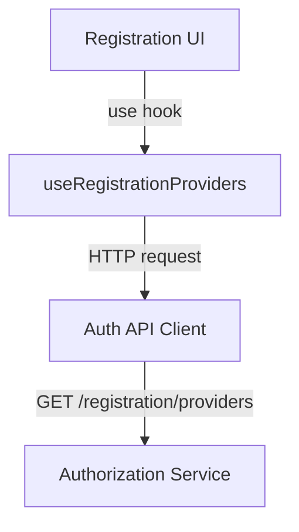
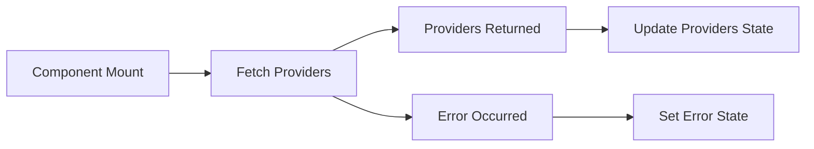

# use_registration_providers

## Overview

The `use_registration_providers` module is a **frontend authentication hook** used during **tenant and user registration flows** to discover which **Single Sign-On (SSO) providers** are available for self-registration.

It encapsulates:
- Fetching registration-capable SSO providers from the authorization backend
- Normalizing provider data for UI consumption
- Managing loading and error state for registration screens

This hook is typically consumed by **registration and onboarding UI components** to dynamically render available SSO options (for example, Google or Microsoft sign-up buttons).

---

## Core Responsibility

The module answers a single question:

> *Which SSO providers are available and enabled for user registration in the current tenant context?*

It does **not**:
- Handle login flows
- Perform OAuth redirects
- Decide invitation-based access rules

Those concerns are handled elsewhere in the authentication stack.

---

## Public API

### Hook Signature

```typescript
export function useRegistrationProviders(): {
  providers: SSOProvider[]
  loading: boolean
  error: string | null
}
```

### Data Types

```typescript
export interface SSOProvider {
  provider: string
  enabled: boolean
}
```

### Returned State

| Field | Type | Description |
|------|------|-------------|
| `providers` | `SSOProvider[]` | List of available SSO providers for registration |
| `loading` | `boolean` | Indicates whether providers are being fetched |
| `error` | `string \| null` | Error message if fetching fails |

---

## Internal Behavior

### Fetch Lifecycle

- Executes once on initial render
- Calls the authentication API to retrieve registration providers
- Transforms raw provider identifiers into UI-friendly objects
- Handles network and API-level failures gracefully

### Provider Normalization

Backend responses return a simple list of provider identifiers:

```text
["google", "microsoft"]
```

The hook converts these into:

```typescript
[
  { provider: "google", enabled: true },
  { provider: "microsoft", enabled: true }
]
```

This normalization allows the UI to later support feature flags or provider-level toggles without changing the API contract.

---

## Dependency Graph



---

## Data Flow



---

## Integration in the Platform

### Backend Source of Truth

The provider list originates from the **authorization service**, which:
- Determines which SSO providers are configured
- Applies tenant-level and policy-level constraints
- Exposes a registration-safe provider discovery endpoint

The frontend hook remains intentionally thin and policy-agnostic.

### Relationship to Other Auth Hooks

- **Login flows** use separate hooks focused on authentication and token handling
- **Invitation-based registration** relies on invitation-aware provider discovery
- **Registration providers** are explicitly limited to *self-registration* scenarios

This separation prevents accidental exposure of providers that should only be usable through invitations.

---

## Error Handling Strategy

| Scenario | Behavior |
|--------|----------|
| Network failure | Providers cleared, error message set |
| API error response | Providers cleared, backend error surfaced |
| Empty provider list | UI receives empty array, no error |

This ensures registration pages can:
- Hide SSO buttons when unavailable
- Display fallback flows (for example, email/password)
- Surface actionable error messages when appropriate

---

## Example Usage

```typescript
import { useRegistrationProviders } from '@/app/auth/hooks/use-registration-providers'

export function RegistrationOptions() {
  const { providers, loading, error } = useRegistrationProviders()

  if (loading) return <div>Loading providers...</div>
  if (error) return <div>{error}</div>

  return (
    <div>
      {providers.map(p => (
        <button key={p.provider} disabled={!p.enabled}>
          Sign up with {p.provider}
        </button>
      ))}
    </div>
  )
}
```

---

## Design Considerations

- **Single responsibility**: focuses only on provider discovery
- **Future-proofing**: `enabled` flag allows gradual rollout or feature gating
- **SSR-safe**: explicitly marked as a client-side hook
- **Composable**: can be combined with registration, invitation, or tenant hooks

---

## Summary

The `use_registration_providers` module is a small but critical piece of the OpenFrame authentication experience. It provides a clean, reliable abstraction for discovering which SSO providers are available during registration, enabling dynamic and tenant-aware onboarding flows without leaking backend policy logic into the UI.
