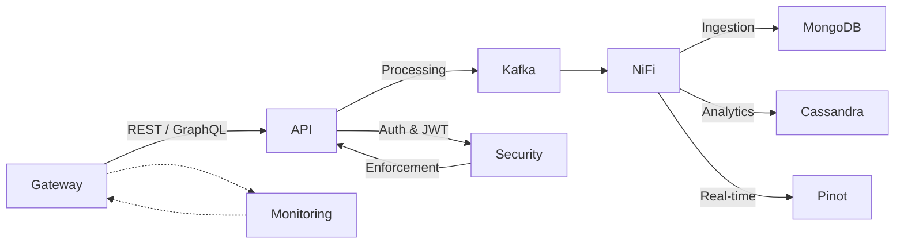

# System Architecture

This document provides an overview of the OpenFrame system architecture, 
highlighting how various services and data stores interact.

## Overview
- High-level structure and main components.  
- Data flow diagrams (mermaid or other) for critical request/response cycles.

## Key Components
- Gateway (e.g., Spring Cloud Gateway, GraphQL)  
- Processing (NiFi, Kafka)  
- Data (MongoDB, Cassandra, Pinot)  
- Security (JWT, OAuth 2.0, Tenant Isolation)

## Communication Patterns
- Event-driven with Kafka.  
- RESTful/GraphQL interactions between services.  
- Possible service mesh (e.g., Istio) for more advanced traffic control/observability.

## Future Enhancements
- Additional microservices or specialized processors.  
- Enhanced AI/ML pipelines.

## System Diagrams
Below is an example mermaid diagram illustrating a simple request flow between services:

