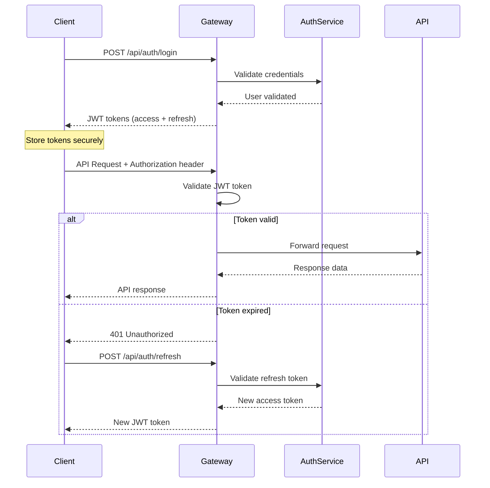
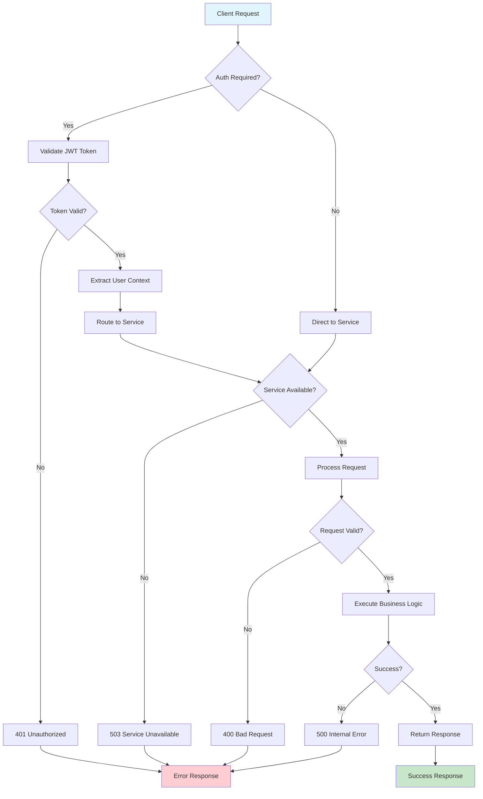

# API Usage Examples

<div align="center">


</div>

This comprehensive guide covers the OpenFrame API endpoints, authentication flows, and practical usage examples for developers integrating with the platform.

## 🚀 Main API Endpoints

| Method | Path | Description | Auth Required |
|--------|------|-------------|---------------|
| `POST` | `/api/auth/login` | Authenticate user and obtain JWT token | ❌ |
| `POST` | `/api/auth/refresh` | Refresh expired JWT token | ✅ |
| `GET` | `/api/users/profile` | Get current user profile | ✅ |
| `PUT` | `/api/users/profile` | Update user profile | ✅ |
| `GET` | `/api/tools` | List available tools and services | ✅ |
| `POST` | `/api/tools/{id}/proxy` | Proxy request to integrated tool | ✅ |
| `GET` | `/api/analytics/events` | Query analytics events | ✅ |
| `POST` | `/api/analytics/events` | Submit new analytics event | ✅ |
| `GET` | `/api/management/health` | System health status | ✅ |
| `GET` | `/api/management/metrics` | Platform metrics and statistics | ✅ |
| `POST` | `/api/stream/events` | Send real-time events | ✅ |
| `WS` | `/ws/stream` | WebSocket connection for real-time data | ✅ |

## 🔐 Authentication Flow

OpenFrame uses JWT-based authentication with OAuth2/OpenID Connect support.



## 📋 Common Use Cases

### 1. User Authentication

```typescript
interface LoginRequest {
  username: string;
  password: string;
}

interface AuthResponse {
  access_token: string;
  refresh_token: string;
  expires_in: number;
  user: {
    id: string;
    username: string;
    email: string;
    roles: string[];
  };
}

// Login example
const login = async (credentials: LoginRequest): Promise<AuthResponse> => {
  const response = await fetch('/api/auth/login', {
    method: 'POST',
    headers: {
      'Content-Type': 'application/json',
    },
    body: JSON.stringify(credentials),
  });

  if (!response.ok) {
    throw new Error(`Login failed: ${response.statusText}`);
  }

  return response.json();
};

// Usage
const auth = await login({
  username: 'admin',
  password: 'secure_password'
});

// Store tokens securely
localStorage.setItem('access_token', auth.access_token);
localStorage.setItem('refresh_token', auth.refresh_token);
```

### 2. Authenticated API Requests

```typescript
class OpenFrameClient {
  private baseUrl: string;
  private accessToken: string;

  constructor(baseUrl: string, accessToken: string) {
    this.baseUrl = baseUrl;
    this.accessToken = accessToken;
  }

  private async makeRequest<T>(
    endpoint: string, 
    options: RequestInit = {}
  ): Promise<T> {
    const response = await fetch(`${this.baseUrl}${endpoint}`, {
      ...options,
      headers: {
        'Authorization': `Bearer ${this.accessToken}`,
        'Content-Type': 'application/json',
        ...options.headers,
      },
    });

    if (!response.ok) {
      throw new Error(`API request failed: ${response.statusText}`);
    }

    return response.json();
  }

  // Get user profile
  async getUserProfile() {
    return this.makeRequest('/api/users/profile');
  }

  // List available tools
  async getTools() {
    return this.makeRequest('/api/tools');
  }

  // Get system health
  async getSystemHealth() {
    return this.makeRequest('/api/management/health');
  }
}
```

### 3. Real-time WebSocket Connection

```typescript
class OpenFrameWebSocket {
  private ws: WebSocket | null = null;
  private accessToken: string;

  constructor(wsUrl: string, accessToken: string) {
    this.accessToken = accessToken;
    this.connect(wsUrl);
  }

  private connect(wsUrl: string) {
    this.ws = new WebSocket(`${wsUrl}/ws/stream?token=${this.accessToken}`);

    this.ws.onopen = () => {
      console.log('✅ WebSocket connected');
      this.subscribe(['events', 'metrics', 'alerts']);
    };

    this.ws.onmessage = (event) => {
      const data = JSON.parse(event.data);
      this.handleMessage(data);
    };

    this.ws.onerror = (error) => {
      console.error('❌ WebSocket error:', error);
    };

    this.ws.onclose = () => {
      console.log('🔌 WebSocket disconnected');
      // Implement reconnection logic
      setTimeout(() => this.connect(wsUrl), 5000);
    };
  }

  private subscribe(topics: string[]) {
    if (this.ws?.readyState === WebSocket.OPEN) {
      this.ws.send(JSON.stringify({
        action: 'subscribe',
        topics: topics
      }));
    }
  }

  private handleMessage(data: any) {
    switch (data.type) {
      case 'event':
        console.log('📊 New event:', data.payload);
        break;
      case 'metric':
        console.log('📈 Metric update:', data.payload);
        break;
      case 'alert':
        console.log('🚨 Alert:', data.payload);
        break;
    }
  }

  send(message: any) {
    if (this.ws?.readyState === WebSocket.OPEN) {
      this.ws.send(JSON.stringify(message));
    }
  }
}
```

### 4. Analytics Event Submission

```typescript
interface AnalyticsEvent {
  eventType: string;
  timestamp: string;
  userId?: string;
  metadata: Record<string, any>;
}

// Submit analytics event
const submitEvent = async (event: AnalyticsEvent) => {
  const client = new OpenFrameClient('https://api.openframe.dev', accessToken);
  
  const response = await fetch('/api/analytics/events', {
    method: 'POST',
    headers: {
      'Authorization': `Bearer ${accessToken}`,
      'Content-Type': 'application/json',
    },
    body: JSON.stringify({
      eventType: 'user_login',
      timestamp: new Date().toISOString(),
      userId: 'user-123',
      metadata: {
        source: 'web',
        userAgent: navigator.userAgent,
        location: 'dashboard'
      }
    }),
  });

  if (!response.ok) {
    throw new Error(`Failed to submit event: ${response.statusText}`);
  }

  return response.json();
};
```

## 🔄 API Request/Response Flow



## ❌ Error Handling Patterns

### Standard Error Responses

All API endpoints follow consistent error response patterns:

```typescript
interface ApiError {
  error: {
    code: string;
    message: string;
    details?: any;
    timestamp: string;
    requestId: string;
  };
}
```

### Common HTTP Status Codes

| Status Code | Meaning | Example Response |
|-------------|---------|------------------|
| `400` | Bad Request | Invalid request payload |
| `401` | Unauthorized | Missing or invalid JWT token |
| `403` | Forbidden | Insufficient permissions |
| `404` | Not Found | Resource not found |
| `429` | Too Many Requests | Rate limit exceeded |
| `500` | Internal Server Error | Unexpected server error |
| `503` | Service Unavailable | Service temporarily down |

### Error Response Examples

```json
// 401 Unauthorized
{
  "error": {
    "code": "UNAUTHORIZED",
    "message": "Invalid or expired token",
    "timestamp": "2024-01-15T10:30:00Z",
    "requestId": "req-123-456-789"
  }
}

// 400 Bad Request
{
  "error": {
    "code": "VALIDATION_ERROR",
    "message": "Invalid request payload",
    "details": {
      "field": "email",
      "reason": "Invalid email format"
    },
    "timestamp": "2024-01-15T10:30:00Z",
    "requestId": "req-123-456-790"
  }
}

// 429 Rate Limit
{
  "error": {
    "code": "RATE_LIMIT_EXCEEDED",
    "message": "Too many requests",
    "details": {
      "limit": 100,
      "remaining": 0,
      "resetTime": "2024-01-15T11:00:00Z"
    },
    "timestamp": "2024-01-15T10:30:00Z",
    "requestId": "req-123-456-791"
  }
}
```

### Robust Error Handling Implementation

```typescript
class ApiErrorHandler {
  static async handleResponse<T>(response: Response): Promise<T> {
    if (!response.ok) {
      const errorData = await response.json();
      throw new ApiError(response.status, errorData.error);
    }
    return response.json();
  }

  static isRetryableError(error: ApiError): boolean {
    return [429, 500, 502, 503, 504].includes(error.status);
  }

  static async withRetry<T>(
    operation: () => Promise<T>,
    maxRetries: number = 3,
    delay: number = 1000
  ): Promise<T> {
    let lastError: Error;

    for (let i = 0; i < maxRetries; i++) {
      try {
        return await operation();
      } catch (error) {
        lastError = error as Error;
        
        if (error instanceof ApiError && !this.isRetryableError(error)) {
          throw error; // Don't retry non-retryable errors
        }

        if (i < maxRetries - 1) {
          await new Promise(resolve => setTimeout(resolve, delay * (i + 1)));
        }
      }
    }

    throw lastError!;
  }
}

class ApiError extends Error {
  constructor(
    public status: number,
    public error: ApiError['error']
  ) {
    super(error.message);
    this.name = 'ApiError';
  }
}
```

## 📚 Best Practices

### 🔐 Security Best Practices

> **Important:** Always implement proper security measures when working with APIs.

- **🔑 Token Storage**: Store JWT tokens in secure storage (not localStorage for production)
- **🔄 Token Refresh**: Implement automatic token refresh before expiration
- **🛡️ HTTPS Only**: Always use HTTPS in production environments
- **🚫 No Hardcoded Secrets**: Never hardcode API keys or secrets in client-side code

### 🚀 Performance Optimization

> **Pro Tip:** Implement these patterns to improve API performance and reliability.

- **📦 Request Batching**: Batch multiple related requests when possible
- **💾 Response Caching**: Cache GET responses with appropriate TTL values
- **🔄 Connection Pooling**: Reuse HTTP connections for better performance
- **📊 Request Monitoring**: Monitor API response times and error rates

### 🔄 Reliability Patterns

<details>
<summary><strong>Advanced Reliability Techniques</strong></summary>

- **🔁 Exponential Backoff**: Implement increasing delays between retries
- **🔵 Circuit Breaker**: Prevent cascading failures with circuit breaker pattern
- **⏱️ Timeout Handling**: Set appropriate request timeouts
- **📋 Request Logging**: Log all API requests for debugging and monitoring

</details>

### 📱 Client Implementation

> **Note:** Follow these patterns for robust client implementation.

- **🔄 Auto-Retry Logic**: Implement retry logic for transient failures
- **📶 Offline Support**: Handle offline scenarios gracefully
- **🔔 Error User Feedback**: Provide clear error messages to users
- **📊 Progress Indicators**: Show loading states for long-running operations

### 🔍 Monitoring & Debugging

- **📊 Request Tracing**: Include request IDs for end-to-end tracing
- **⚠️ Error Alerting**: Set up alerts for high error rates
- **📈 Performance Metrics**: Monitor API latency and throughput
- **🔍 Log Correlation**: Use correlation IDs to trace requests across services

---

<div align="center">

**Need Help?** 📖 [Documentation](https://www.flamingo.run/knowledge-base) • 💬 [Community](https://www.openmsp.ai/) • 🐛 [Issues](https://github.com/flamingo-stack/openframe-oss-tenant/issues)

</div>