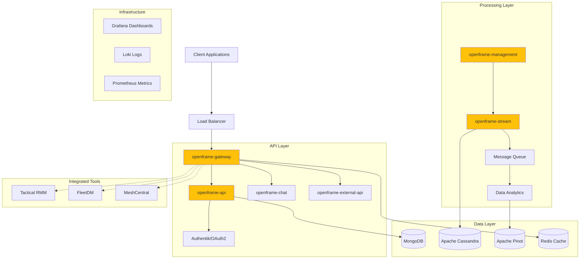
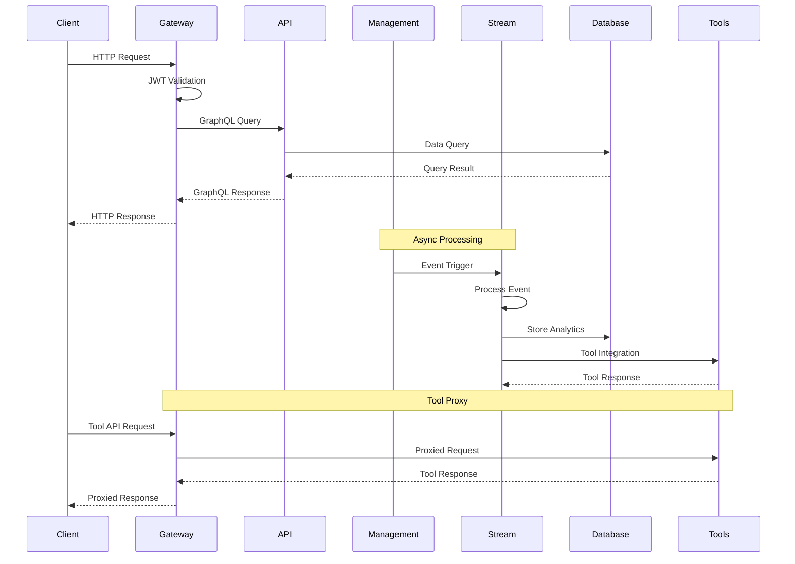
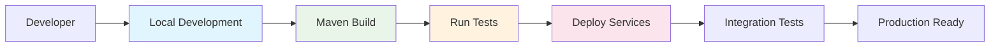

# Architecture Overview 🏗️

OpenFrame is a distributed platform that provides a unified layer for data, APIs, automation, and AI operations. This document provides a comprehensive overview of the system architecture, components, and design patterns.

## 🎯 High-Level Architecture



## 📋 Core Components

| Component | Technology | Responsibility | Port |
|-----------|------------|----------------|------|
| **openframe-gateway** | Java/Spring Boot | API Gateway, Authentication, WebSocket, Tool Proxy | 8080 |
| **openframe-api** | Java/Spring Boot | GraphQL API, User Management, OAuth2/OIDC | 8081 |
| **openframe-management** | Java/Spring Boot | Admin Operations, Scheduled Tasks, System Management | 8082 |
| **openframe-stream** | Java/Spring Boot | Real-time Data Processing, Event Streaming | 8083 |
| **openframe-chat** | Java/Spring Boot | AI Chat Interface, LLM Integration | 8084 |
| **openframe-external-api** | Java/Spring Boot | External System Integration APIs | 8085 |
| **openframe-frontend** | Vue.js/TypeScript | Web UI, Dashboard, User Interface | 3000 |
| **client** | Rust | CLI Tool, Automation Client | - |

## 🔄 Data Flow Architecture



## 🔧 Key Design Decisions

### Microservices Architecture
- **Pattern**: Domain-driven design with service boundaries
- **Communication**: HTTP/REST for synchronous, messaging for async
- **Benefits**: Independent deployment, technology diversity, scalability

### API Gateway Pattern
- **Implementation**: Custom Spring Boot gateway service
- **Features**: Authentication, rate limiting, request routing, tool proxy
- **Security**: JWT tokens, OAuth2/OIDC integration

### Event-Driven Processing
- **Pattern**: Event sourcing with stream processing
- **Implementation**: Apache Kafka-like messaging with custom processors
- **Use Cases**: Real-time analytics, audit logging, system automation

### Tool Integration Strategy
- **Pattern**: Proxy pattern for external tool APIs
- **Benefits**: Unified authentication, consistent API surface, centralized monitoring
- **Supported Tools**: Tactical RMM, FleetDM, MeshCentral, Authentik

> 💡 **Pro Tip**: The gateway acts as a single point of entry, simplifying client integration and providing consistent security policies across all services.

## 📁 Directory Structure

<details>
<summary>🗂️ Project Structure (Click to expand)</summary>

```
openframe/
├── 📁 openframe/                           # Main platform services
│   ├── 📁 config/                          # Shared configuration
│   │   └── 📄 openframe-config/            # Configuration library
│   ├── 📁 libraries/                       # Shared libraries
│   │   └── 📄 openframe-frontend-lib/      # Frontend component library
│   ├── 📁 services/                        # Core microservices
│   │   ├── 📄 openframe-gateway/           # API Gateway service
│   │   ├── 📄 openframe-api/               # Main GraphQL API
│   │   ├── 📄 openframe-management/        # Admin & system management
│   │   ├── 📄 openframe-stream/            # Stream processing service
│   │   ├── 📄 openframe-chat/              # AI chat service
│   │   ├── 📄 openframe-external-api/      # External integrations
│   │   └── 📄 openframe-frontend/          # Vue.js web application
│   └── 📁 tests/
│       └── 📄 openframe-e2e-tests/         # End-to-end test suite
├── 📁 client/                              # Rust CLI client
├── 📁 integrated-tools/                    # External tool configurations
│   ├── 📁 authentik/                       # Identity provider
│   ├── 📁 fleetmdm/                        # Device management
│   ├── 📁 meshcentral/                     # Remote access
│   └── 📁 tactical-rmm/                    # Remote monitoring
├── 📁 scripts/                             # Platform startup scripts
│   ├── 📄 run-mac.sh                       # macOS startup
│   ├── 📄 run-linux.sh                     # Linux startup
│   └── 📄 run-windows.ps1                  # Windows startup
├── 📁 docs/                                # Documentation
└── 📄 pom.xml                              # Maven parent configuration
```

</details>

### Service-Specific Structure

Each Java service follows a consistent Maven structure:

```
service-name/
├── 📁 src/main/java/com/flamingo/openframe/
│   ├── 📁 config/                          # Spring configuration
│   ├── 📁 controller/                      # REST/GraphQL controllers
│   ├── 📁 service/                         # Business logic
│   ├── 📁 repository/                      # Data access
│   └── 📁 model/                           # Domain models
├── 📁 src/main/resources/                  # Configuration files
├── 📁 src/test/                            # Unit tests
└── 📄 pom.xml                              # Maven configuration
```

## 🔐 Security Architecture

| Layer | Security Measures |
|-------|------------------|
| **Gateway** | JWT validation, rate limiting, CORS |
| **API** | OAuth2/OIDC, role-based access control |
| **Database** | Encrypted connections, credential rotation |
| **Tools** | Proxy authentication, API key management |
| **Network** | TLS/SSL, internal service mesh |

## 🚀 Development Workflow



## 📊 Performance Characteristics

| Metric | Target | Implementation |
|--------|--------|----------------|
| **API Latency** | < 500ms | Caching, connection pooling |
| **Throughput** | 100K+ events/sec | Stream processing, async messaging |
| **Availability** | 99.9%+ | Service redundancy, health checks |
| **Data Consistency** | Eventually consistent | Event sourcing, CQRS patterns |

> ⚠️ **Important**: The platform is designed for high-throughput scenarios with eventual consistency. Critical operations use synchronous patterns where immediate consistency is required.

## 🛠️ Getting Started

<details>
<summary>Quick Development Setup</summary>

1. **Prerequisites**
   ```bash
   # Required tools
   java -version    # Java 17+
   mvn --version    # Maven 3.8+
   node --version   # Node.js 16+
   cargo --version  # Rust 1.70+
   ```

2. **Build Platform**
   ```bash
   mvn clean install -DskipTests
   ```

3. **Start Services**
   ```bash
   # Platform-specific scripts
   ./scripts/run-mac.sh --silent     # macOS
   ./scripts/run-linux.sh --silent   # Linux
   ```

4. **Access Dashboard**
   - Web UI: http://localhost:3000
   - API Gateway: http://localhost:8080
   - GraphQL Playground: http://localhost:8081/graphql

</details>

---

> 📚 **Next Steps**: Check out our [API Documentation](https://www.flamingo.run/knowledge-base) and [Community Resources](https://www.openmsp.ai/) for detailed implementation guides.