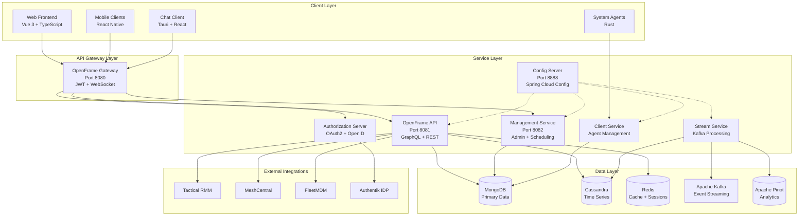
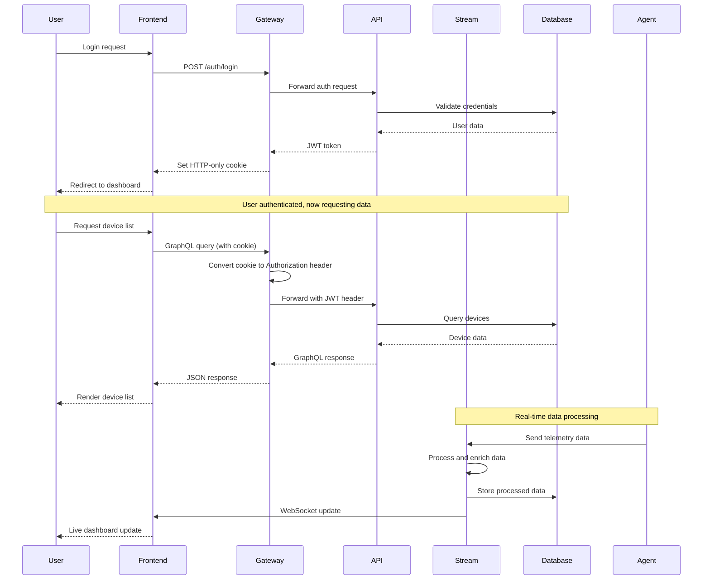
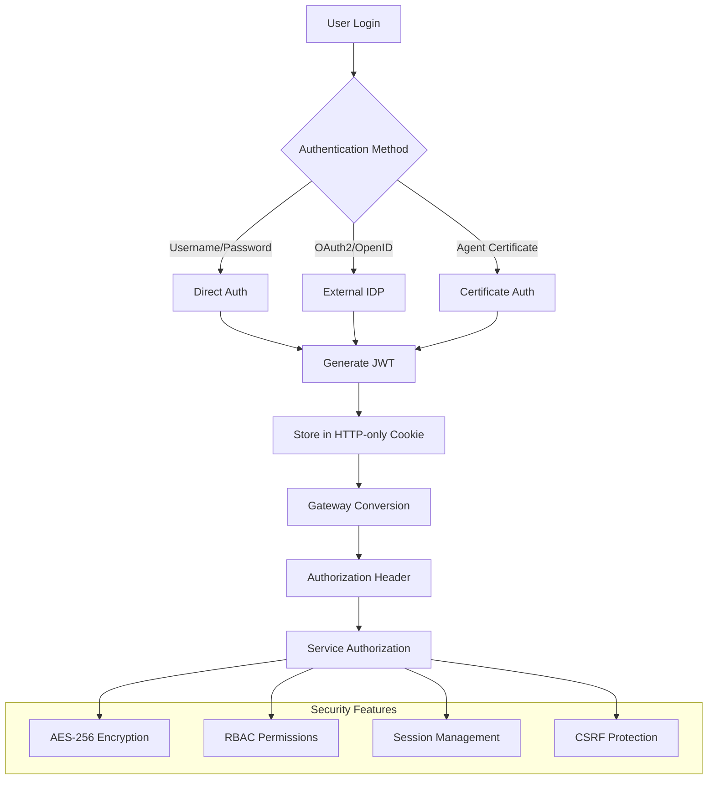
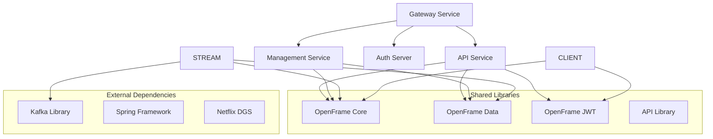
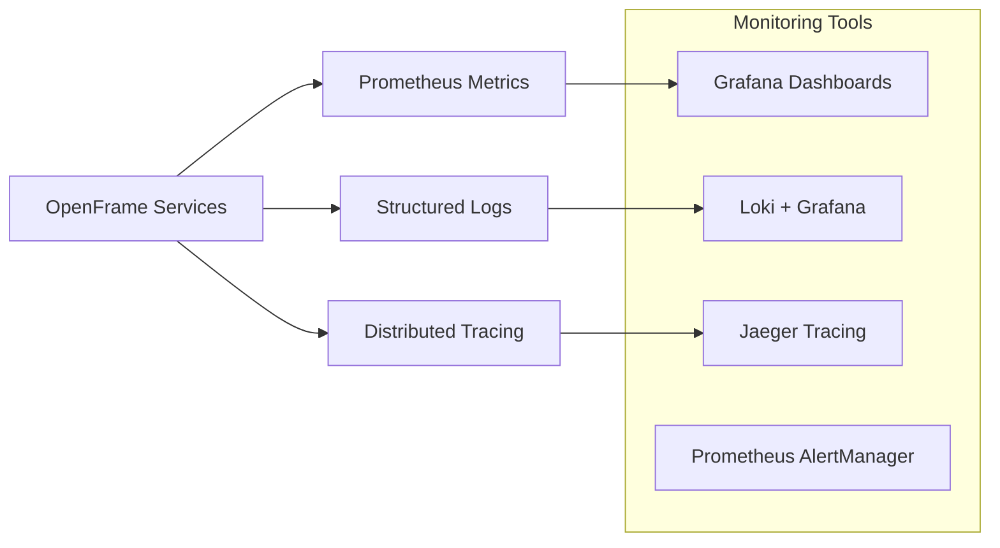

# OpenFrame Architecture Overview for Developers

This technical guide provides an in-depth look at OpenFrame's architecture, core components, and design patterns. Understanding this architecture is essential for effective development, debugging, and extending the platform.

## High-Level Architecture

OpenFrame follows a distributed microservices architecture with clear separation of concerns and modern technology stack integration.



## Core Components and Responsibilities

| Component | Port | Primary Responsibility | Key Technologies |
|-----------|------|----------------------|------------------|
| **OpenFrame Gateway** | 8080 | API routing, authentication, WebSocket handling | Spring Cloud Gateway, JWT |
| **OpenFrame API** | 8081 | GraphQL API, user management, OAuth2 | Netflix DGS, Spring Security |
| **OpenFrame Management** | 8082 | Administrative tasks, scheduled jobs | Spring Boot, Quartz Scheduler |
| **OpenFrame Stream** | N/A | Real-time data processing, event handling | Apache Kafka, Spring Cloud Stream |
| **OpenFrame Client** | N/A | Agent management, device authentication | Spring Boot, WebSocket |
| **OpenFrame Config** | 8888 | Centralized configuration management | Spring Cloud Config Server |
| **Authorization Server** | N/A | OAuth2/OpenID Connect provider | Spring Authorization Server |
| **Frontend** | 3000 | User interface, dashboards, device management | Vue 3, TypeScript, PrimeVue |

## Data Flow Architecture

The following sequence diagram illustrates how data flows through the OpenFrame system for a typical user interaction:



## Authentication and Security Architecture

OpenFrame implements a sophisticated security model with multiple layers of protection:

### Authentication Flow



### Security Components

- **JWT Implementation**: Custom implementation with cookie-based storage
- **OAuth2/OpenID Connect**: Integration with external identity providers
- **Role-Based Access Control (RBAC)**: Fine-grained permissions system
- **AES-256 Encryption**: Data encryption at rest and in transit
- **Session Management**: Secure session handling with Redis

## Service Communication Patterns

### Internal Communication

| Communication Type | Use Case | Technology | Example |
|--------------------|----------|------------|---------|
| **Synchronous HTTP** | API calls between services | Spring WebClient | Gateway → API service calls |
| **Asynchronous Events** | Background processing | Apache Kafka | Device data → Stream processing |
| **Configuration Updates** | Dynamic config changes | Spring Cloud Bus | Config server → All services |
| **WebSocket** | Real-time updates | Spring WebSocket | Live dashboard updates |

### External Integration Patterns

```java
// Example: External API integration pattern
@RestController
@RequestMapping("/api/external")
public class ExternalIntegrationController {
    
    @Autowired
    private ExternalServiceClient externalClient;
    
    @PostMapping("/tactical-rmm/devices")
    public ResponseEntity<DeviceResponse> syncDevices() {
        return externalClient.executeWithRetry(
            () -> tacticalRmmService.syncDevices(),
            3, // max retries
            Duration.ofSeconds(2) // backoff
        );
    }
}
```

## Key Design Patterns

### 1. Gateway Pattern
The OpenFrame Gateway serves as the single entry point for all client requests:

```java
// Simplified gateway routing configuration
@Configuration
public class GatewayConfig {
    
    @Bean
    public RouteLocator customRoutes(RouteLocatorBuilder builder) {
        return builder.routes()
            .route("api", r -> r.path("/api/**")
                .filters(f -> f
                    .rewritePath("/api/(?<segment>.*)", "/${segment}")
                    .addRequestHeader("X-Forwarded-Proto", "https"))
                .uri("lb://openframe-api"))
            .route("management", r -> r.path("/admin/**")
                .uri("lb://openframe-management"))
            .build();
    }
}
```

### 2. Event-Driven Architecture
Kafka-based event streaming for scalable data processing:

```java
// Event producer example
@Component
public class DeviceEventPublisher {
    
    @Autowired
    private KafkaTemplate<String, DeviceEvent> kafkaTemplate;
    
    public void publishDeviceUpdate(Device device) {
        DeviceEvent event = DeviceEvent.builder()
            .deviceId(device.getId())
            .eventType(DeviceEventType.STATUS_CHANGE)
            .timestamp(Instant.now())
            .data(device.toEventData())
            .build();
            
        kafkaTemplate.send("device-events", device.getId(), event);
    }
}
```

### 3. Repository Pattern with Multiple Data Stores
Optimized data access for different use cases:

```java
// Multi-store repository pattern
@Service
public class DeviceDataService {
    
    @Autowired
    private MongoDeviceRepository mongoRepository; // Operational data
    
    @Autowired
    private CassandraTimeSeriesRepository cassandraRepository; // Time series
    
    @Autowired
    private RedisDeviceCache redisCache; // Caching
    
    public Optional<Device> getDevice(String deviceId) {
        return redisCache.get(deviceId)
            .or(() -> {
                Optional<Device> device = mongoRepository.findById(deviceId);
                device.ifPresent(d -> redisCache.put(deviceId, d));
                return device;
            });
    }
    
    public List<DeviceMetric> getDeviceMetrics(String deviceId, TimeRange range) {
        return cassandraRepository.findByDeviceIdAndTimeRange(deviceId, range);
    }
}
```

## Module Dependencies and Relationships

Understanding the dependency graph is crucial for development:

### Service Dependencies



### Data Access Layer Architecture

```java
// Example of layered data access
@Repository
public class DeviceRepositoryImpl implements DeviceRepository {
    
    // Primary data store for operational data
    @Autowired
    private MongoTemplate mongoTemplate;
    
    // Time-series data for metrics and events
    @Autowired
    private CassandraOperations cassandraOperations;
    
    // Caching layer for performance
    @Autowired
    private RedisTemplate<String, Object> redisTemplate;
    
    @Override
    @Cacheable(value = "devices", key = "#deviceId")
    public Optional<Device> findById(String deviceId) {
        Query query = new Query(Criteria.where("id").is(deviceId));
        Device device = mongoTemplate.findOne(query, Device.class);
        return Optional.ofNullable(device);
    }
    
    @Override
    public List<DeviceMetric> getMetricHistory(String deviceId, Duration period) {
        Select select = QueryBuilder.selectFrom("device_metrics")
            .all()
            .whereColumn("device_id").isEqualTo(literal(deviceId))
            .whereColumn("timestamp").isGreaterThan(
                literal(Instant.now().minus(period)));
        
        return cassandraOperations.select(select, DeviceMetric.class);
    }
}
```

## Configuration Management

OpenFrame uses Spring Cloud Config for centralized configuration:

### Configuration Hierarchy

```yaml
# application.yml (default)
spring:
  application:
    name: openframe-api
  cloud:
    config:
      uri: http://config-server:8888
      
# application-development.yml (development profile)
logging:
  level:
    com.openframe: DEBUG
    
# application-production.yml (production profile)
spring:
  datasource:
    mongodb:
      uri: ${MONGODB_URI}
    cassandra:
      contact-points: ${CASSANDRA_HOSTS}
      
security:
  jwt:
    secret: ${JWT_SECRET}
```

## Monitoring and Observability

OpenFrame includes comprehensive monitoring capabilities:

### Metrics and Health Checks

| Endpoint | Purpose | Example Response |
|----------|---------|------------------|
| `/actuator/health` | Service health status | `{"status": "UP", "components": {...}}` |
| `/actuator/metrics` | Application metrics | Prometheus format metrics |
| `/actuator/info` | Build and version info | `{"build": {"version": "1.0.0"}}` |
| `/actuator/env` | Environment configuration | Configuration properties |

### Observability Stack



## Development and Testing Patterns

### Test Architecture

```java
// Example integration test pattern
@SpringBootTest(webEnvironment = SpringBootTest.WebEnvironment.RANDOM_PORT)
@TestPropertySource(properties = {
    "spring.datasource.mongodb.uri=mongodb://localhost:27017/test",
    "spring.kafka.bootstrap-servers=localhost:9092"
})
class DeviceServiceIntegrationTest {
    
    @Autowired
    private TestRestTemplate restTemplate;
    
    @MockBean
    private ExternalServiceClient externalServiceClient;
    
    @Test
    void testDeviceCreation() {
        // Given
        DeviceCreateRequest request = DeviceCreateRequest.builder()
            .name("Test Device")
            .type(DeviceType.SERVER)
            .build();
            
        // When
        ResponseEntity<Device> response = restTemplate.postForEntity(
            "/api/devices", request, Device.class);
            
        // Then
        assertThat(response.getStatusCode()).isEqualTo(HttpStatus.CREATED);
        assertThat(response.getBody().getName()).isEqualTo("Test Device");
    }
}
```

## Performance Considerations

### Optimization Strategies

1. **Database Optimization**
   - Use appropriate indexes for MongoDB queries
   - Partition Cassandra tables by time and device ID
   - Implement Redis caching for frequently accessed data

2. **Network Optimization**
   - Enable HTTP/2 for gateway communications
   - Use connection pooling for database connections
   - Implement request/response compression

3. **Memory Management**
   - Configure JVM heap sizes appropriately
   - Use off-heap caching where beneficial
   - Monitor for memory leaks in long-running processes

## Deployment Architecture

OpenFrame supports multiple deployment models:

### Kubernetes Deployment

```yaml
# Example Kubernetes deployment pattern
apiVersion: apps/v1
kind: Deployment
metadata:
  name: openframe-api
spec:
  replicas: 3
  selector:
    matchLabels:
      app: openframe-api
  template:
    metadata:
      labels:
        app: openframe-api
    spec:
      containers:
      - name: api
        image: openframe/openframe-api:latest
        ports:
        - containerPort: 8081
        env:
        - name: SPRING_PROFILES_ACTIVE
          value: "kubernetes"
        resources:
          requests:
            memory: "1Gi"
            cpu: "500m"
          limits:
            memory: "2Gi"
            cpu: "1000m"
```

## Next Steps for Developers

After understanding this architecture:

1. **Deep Dive into Specific Services**: Study the service you'll be working on
2. **Review API Contracts**: Understand GraphQL schemas and REST endpoints
3. **Set Up Local Development**: Follow the [Developer Getting Started Guide](getting-started-dev.md)
4. **Explore Integration Points**: Understand how external systems integrate
5. **Study Security Implementation**: Review JWT and OAuth2 implementations

## Additional Resources

- **Spring Cloud Documentation**: [Official Spring Cloud Docs](https://spring.io/projects/spring-cloud)
- **Apache Kafka**: [Kafka Streams Documentation](https://kafka.apache.org/documentation/streams/)
- **Vue 3 Architecture**: [Vue.js Official Architecture Guide](https://vuejs.org/guide/scaling-up/)
- **Microservices Patterns**: [Microservices.io](https://microservices.io/)

This architecture overview provides the foundation for effective OpenFrame development. As the platform evolves, ensure to keep this documentation updated to reflect architectural changes and improvements.