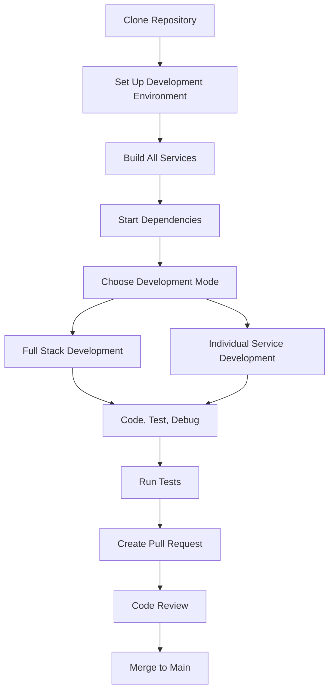

# Developer Getting Started Guide

Welcome to OpenFrame development! This comprehensive guide will help you set up your development environment, understand the codebase structure, and start contributing to the platform.

## Development Environment Setup

### Prerequisites for Developers

| Tool | Version | Purpose | Installation |
|------|---------|---------|--------------|
| **Java JDK** | 21+ | Backend services | `sdk install java 21.0.1-tem` (via SDKMan) |
| **Maven** | 3.9+ | Build tool | `brew install maven` (macOS) |
| **Node.js** | 18+ LTS | Frontend development | `nvm install --lts` |
| **npm** | 9+ | Package management | Included with Node.js |
| **Docker** | 24+ | Container runtime | [Get Docker](https://docs.docker.com/get-docker/) |
| **Docker Compose** | 2.0+ | Multi-service orchestration | Included with Docker Desktop |
| **Git** | 2.40+ | Version control | `git --version` to check |
| **IDE** | Latest | Code editing | IntelliJ IDEA, VS Code, or similar |

### Advanced Developer Tools (Optional)
- **Kubernetes** (1.28+): For local cluster testing with minikube or kind
- **Helm** (3.0+): For Kubernetes deployment management
- **Rust** (1.70+): For client agent development
- **PostgreSQL Client**: For database administration

## Repository Structure

Understanding the codebase layout is crucial for effective development:

```
openframe/
├── openframe/                          # Java services and libraries
│   ├── services/                       # Microservices
│   │   ├── openframe-api/              # GraphQL API (port 8081)
│   │   ├── openframe-gateway/          # API Gateway (port 8080)
│   │   ├── openframe-management/       # Admin service (port 8082)
│   │   ├── openframe-stream/           # Kafka stream processing
│   │   ├── openframe-config/           # Config server (port 8888)
│   │   ├── openframe-client/           # Agent management service
│   │   ├── openframe-external-api/     # External integrations
│   │   ├── openframe-authorization-server/ # OAuth2 provider
│   │   └── openframe-frontend/         # Vue.js frontend (port 3000)
│   └── libs/                           # Shared libraries
│       ├── openframe-core/             # Core models and utilities
│       ├── openframe-data/             # Data access layer (MongoDB, Cassandra, Redis)
│       ├── openframe-jwt/              # JWT security implementation
│       └── api-library/                # Common API services and DTOs
├── clients/                            # Client applications
│   └── openframe-chat/                 # Tauri-based chat client
├── client/                             # Rust system agent (cross-platform)
├── manifests/                          # Kubernetes Helm charts
│   ├── platform/                       # Core platform services
│   └── apps/                           # Application deployments
├── integrated-tools/                   # Docker configs for external tools
│   ├── tactical-rmm/                   # Remote monitoring
│   ├── meshcentral/                    # Remote access
│   ├── fleetmdm/                       # Mobile device management
│   └── authentik/                      # Identity provider
├── scripts/                            # Development and deployment scripts
├── openframe-e2e-tests/               # End-to-end test suite
├── docs/                              # Documentation
│   ├── tutorials/                     # User and developer guides
│   └── codewiki/                      # Generated technical documentation
├── pom.xml                            # Root Maven configuration
└── README.md                          # Project overview
```

## Development Workflow



## Build and Test Commands

### Core Build Commands

```bash
# Build entire platform (all services and libraries)
mvn clean install

# Fast build without tests (for initial setup)
mvn clean install -DskipTests

# Build specific service
cd openframe/services/openframe-api
mvn clean install

# Build with specific profiles
mvn clean install -P development
```

### Testing Commands

```bash
# Run all tests
mvn test

# Run tests for specific service
cd openframe/services/openframe-api
mvn test

# Run integration tests only
mvn verify -P integration-tests

# Run with coverage report
mvn test jacoco:report
```

### Frontend Development Commands

```bash
cd openframe/services/openframe-frontend

# Install dependencies
npm install

# Start development server with hot reload
npm run dev

# Build for production
npm run build

# Run TypeScript type checking
npm run type-check

# Run unit tests
npm run test

# Run e2e tests
npm run test:e2e
```

### Rust Client Development

```bash
cd client

# Build the agent
cargo build

# Run in development mode
cargo run

# Run tests
cargo test

# Build optimized release
cargo build --release

# Cross-compile for different platforms
cargo build --target x86_64-pc-windows-gnu
```

## Local Development Setup

### Method 1: Full Stack Development

```bash
# 1. Clone and build
git clone <repository-url>
cd openframe
mvn clean install -DskipTests

# 2. Start infrastructure dependencies
cd integrated-tools
docker-compose up -d mongodb cassandra redis kafka

# 3. Start services in order (separate terminals)
# Terminal 1: Config Server
cd openframe/services/openframe-config
mvn spring-boot:run

# Terminal 2: Gateway
cd openframe/services/openframe-gateway
mvn spring-boot:run

# Terminal 3: API Service
cd openframe/services/openframe-api
mvn spring-boot:run

# Terminal 4: Frontend
cd openframe/services/openframe-frontend
npm install && npm run dev
```

### Method 2: Individual Service Development

```bash
# Start only the services you're working on
# Use Docker for dependencies you don't need to modify

# Example: Working on API service only
docker-compose -f docker-compose.dev.yml up -d

# Then start just the API service
cd openframe/services/openframe-api
mvn spring-boot:run -Dspring.profiles.active=development
```

## Code Style and Conventions

### Java Code Standards

```java
// Class naming: PascalCase
public class DeviceManagementService {
    
    // Method naming: camelCase with descriptive names
    public Optional<Device> findDeviceBySerialNumber(String serialNumber) {
        // Use lombok for reducing boilerplate
        log.info("Finding device with serial: {}", serialNumber);
        
        // Prefer streams and functional programming
        return devices.stream()
                .filter(device -> serialNumber.equals(device.getSerialNumber()))
                .findFirst();
    }
    
    // Use proper exception handling
    @Transactional
    public Device createDevice(DeviceCreateRequest request) {
        try {
            return deviceRepository.save(mapToEntity(request));
        } catch (DataIntegrityViolationException e) {
            throw new DeviceAlreadyExistsException("Device already exists", e);
        }
    }
}
```

### Frontend Code Standards (TypeScript/Vue 3)

```typescript
// Component naming: PascalCase
<script setup lang="ts">
// Use Composition API with TypeScript
interface Props {
  deviceId: string
  isLoading?: boolean
}

const props = withDefaults(defineProps<Props>(), {
  isLoading: false
})

// Reactive data
const deviceData = ref<Device | null>(null)
const error = ref<string | null>(null)

// Computed properties
const isDeviceOnline = computed(() => 
  deviceData.value?.status === 'online'
)

// Methods with proper typing
const fetchDeviceData = async (): Promise<void> => {
  try {
    const response = await deviceApi.getDevice(props.deviceId)
    deviceData.value = response.data
  } catch (err) {
    error.value = 'Failed to load device data'
    console.error('Device fetch error:', err)
  }
}
</script>
```

### API Design Principles

- **GraphQL First**: Use GraphQL for client-facing APIs
- **RESTful Internal**: Use REST for service-to-service communication
- **Consistent Naming**: Use camelCase for JSON fields
- **Error Handling**: Return meaningful error codes and messages
- **Versioning**: Use semantic versioning for API changes

## Contributing Guidelines

### Git Workflow

```bash
# 1. Create feature branch from main
git checkout main
git pull origin main
git checkout -b feature/device-management-improvements

# 2. Make your changes and commit
git add .
git commit -m "feat: add device batch operations support

- Add bulk device update functionality
- Implement device group management
- Add validation for batch operations

Closes #123"

# 3. Push and create PR
git push origin feature/device-management-improvements
```

### Commit Message Format

```
type(scope): subject

body (optional)

footer (optional)
```

**Types**: `feat`, `fix`, `docs`, `style`, `refactor`, `test`, `chore`
**Scopes**: `api`, `frontend`, `gateway`, `client`, `docs`, etc.

### Pull Request Guidelines

1. **Branch naming**: `feature/`, `bugfix/`, `hotfix/`, `docs/`
2. **PR Description**: Include what changed, why, and testing notes
3. **Tests**: Add/update tests for new functionality
4. **Documentation**: Update relevant documentation
5. **Size**: Keep PRs focused and reasonably sized

## Debug Tips and Common Issues

### Common Development Errors

| Error | Cause | Solution |
|-------|-------|----------|
| **Port 8080 already in use** | Multiple gateway instances | `lsof -ti:8080 \| xargs kill -9` |
| **MongoDB connection refused** | MongoDB not running | `docker-compose up -d mongodb` |
| **JWT signature invalid** | Mismatched secrets | Check JWT configuration in config server |
| **GraphQL schema errors** | Schema definition issues | Run `mvn compile` to regenerate schema |
| **Frontend compilation errors** | TypeScript/dependency issues | `rm -rf node_modules && npm install` |

### Debugging Configuration

#### IntelliJ IDEA Setup
1. Import as Maven project
2. Set Project SDK to Java 21
3. Configure Spring Boot run configurations for each service
4. Enable annotation processing for Lombok

#### VS Code Setup
```json
// .vscode/settings.json
{
  "java.configuration.runtimes": [
    {
      "name": "JavaSE-21",
      "path": "/path/to/java21"
    }
  ],
  "spring.boot.ls.checkjvm": false,
  "java.compile.nullAnalysis.mode": "automatic"
}
```

#### Debug Logging
```yaml
# application-development.yml
logging:
  level:
    com.openframe: DEBUG
    org.springframework.security: DEBUG
    org.springframework.web: DEBUG
```

### Performance Profiling

```bash
# JVM profiling for memory leaks
java -XX:+HeapDumpOnOutOfMemoryError -XX:HeapDumpPath=/tmp/dumps/ -jar target/app.jar

# Enable JFR (Java Flight Recorder)
java -XX:+FlightRecorder -XX:StartFlightRecording=duration=60s,filename=app-profile.jfr -jar target/app.jar
```

## Development Resources

### Useful Endpoints for Development

- **Health Check**: `http://localhost:8080/actuator/health`
- **Metrics**: `http://localhost:8080/actuator/metrics`
- **GraphQL Playground**: `http://localhost:8081/graphql`
- **Swagger UI**: `http://localhost:8080/swagger-ui.html`
- **Config Server**: `http://localhost:8888/actuator/env`

### Database Access

```bash
# MongoDB CLI
mongo mongodb://localhost:27017/openframe

# Cassandra CLI
cqlsh localhost 9042

# Redis CLI
redis-cli -h localhost -p 6379
```

## Next Steps

After completing this setup guide:

1. **Read Architecture Overview**: Check out [architecture-overview-dev.md](architecture-overview-dev.md)
2. **Explore the API**: Use GraphQL playground to understand data models
3. **Run E2E Tests**: Familiarize yourself with the test suite
4. **Join Development Discussions**: Participate in code reviews and design discussions

## Additional Resources

- **Spring Boot Documentation**: [Official Spring Boot Docs](https://spring.io/projects/spring-boot)
- **Vue 3 Composition API**: [Vue 3 Official Guide](https://vuejs.org/guide/)
- **GraphQL Java**: [Netflix DGS Framework](https://netflix.github.io/dgs/)
- **Apache Kafka**: [Kafka Documentation](https://kafka.apache.org/documentation/)

Happy coding! The OpenFrame development team is here to support you as you contribute to the platform.