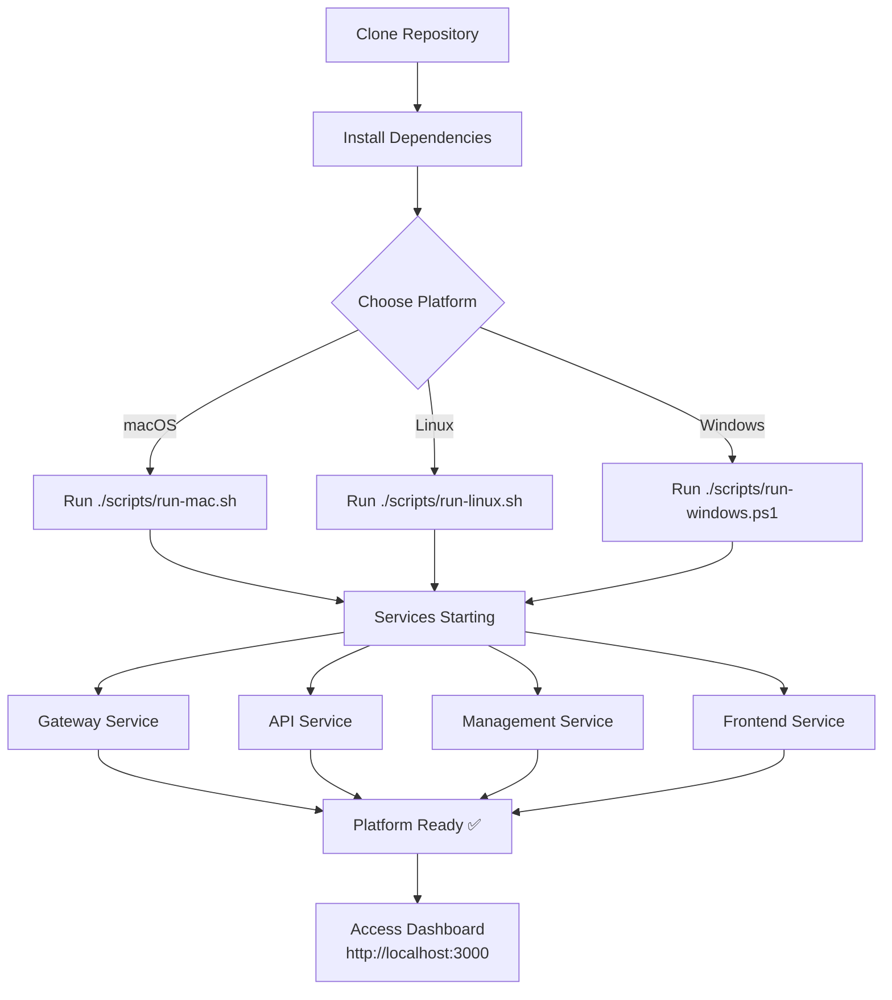

# 🚀 Getting Started with OpenFrame

Welcome to OpenFrame! This guide will walk you through setting up your local development environment and running your first OpenFrame deployment. 

> **💡 Pro Tip**: OpenFrame is a distributed platform, so we'll be setting up multiple services. Don't worry - our setup scripts handle most of the complexity for you!

---

## 📋 Prerequisites

Before starting, ensure you have the following tools installed on your system:

| Tool | Version | Purpose | Installation Link |
|------|---------|---------|-------------------|
| **Java** | 11 or later | Backend services | [Download OpenJDK](https://openjdk.org/) |
| **Maven** | 3.6+ | Java build tool | [Install Maven](https://maven.apache.org/install.html) |
| **Node.js** | 18+ | Frontend development | [Download Node.js](https://nodejs.org/) |
| **npm** | 9+ | Package manager | Comes with Node.js |
| **Rust** | Latest stable | Client tools | [Install Rust](https://rustup.rs/) |
| **Docker** | 20.10+ | Container runtime | [Get Docker](https://docs.docker.com/get-docker/) |
| **Docker Compose** | 2.0+ | Multi-container orchestration | [Install Compose](https://docs.docker.com/compose/install/) |
| **Git** | 2.30+ | Version control | [Download Git](https://git-scm.com/downloads) |

<details>
<summary><b>🔍 Click to verify your installations</b></summary>

Run these commands to verify everything is installed correctly:

```bash
java -version
mvn -version
node --version
npm --version
rustc --version
docker --version
docker-compose --version
git --version
```

</details>

---

## 🛠️ Installation Steps

### 1. Clone the Repository

```bash
git clone https://github.com/flamingo-stack/openframe-oss-tenant.git
cd openframe-oss-tenant
```

### 2. Build the Platform

OpenFrame uses a multi-language stack. Let's build each component:

```bash
# Build all Java services and libraries
mvn clean install

# Build the frontend
cd openframe/services/openframe-frontend
npm install
cd ../../../

# Build the Rust client
cd client
cargo build
cd ..
```

### 3. Setup Process Flow



### 4. Start OpenFrame

Choose the script for your operating system:

**macOS:**
```bash
./scripts/run-mac.sh
```

**Linux:**
```bash
./scripts/run-linux.sh
```

**Windows (PowerShell):**
```powershell
.\scripts\run-windows.ps1
```

> **📝 Note**: The first run will take longer as Docker images are downloaded and services initialize. Subsequent starts will be much faster.

For silent installation (no interactive prompts):
```bash
./scripts/run-mac.sh --silent
# or
./scripts/run-linux.sh --silent
```

---

## ⚙️ Basic Configuration

OpenFrame works out-of-the-box with sensible defaults, but you may want to customize certain settings.

### Environment Configuration

Create a `.env` file in the root directory:

```bash
# .env
OPENFRAME_ENV=development
OPENFRAME_PORT=8080
OPENFRAME_FRONTEND_PORT=3000

# Database Configuration
MONGODB_URI=mongodb://localhost:27017/openframe
REDIS_URL=redis://localhost:6379

# Authentication (optional - uses defaults if not set)
JWT_SECRET=your-secret-key-here
OAUTH_CLIENT_ID=your-oauth-client-id
OAUTH_CLIENT_SECRET=your-oauth-client-secret
```

### Service Configuration

<details>
<summary><b>📁 Advanced: Custom service configuration</b></summary>

Each service can be configured via its respective `application.yml` file:

**Gateway Service** (`openframe/services/openframe-gateway/src/main/resources/application.yml`):
```yaml
server:
  port: 8080
  
openframe:
  security:
    jwt:
      expiration: 3600
    cors:
      allowed-origins: "http://localhost:3000"
```

**API Service** (`openframe/services/openframe-api/src/main/resources/application.yml`):
```yaml
server:
  port: 8081
  
spring:
  data:
    mongodb:
      uri: ${MONGODB_URI:mongodb://localhost:27017/openframe}
```

</details>

---

## 🏃‍♂️ Running the Project Locally

Once the setup script completes, OpenFrame will be running with the following services:

| Service | URL | Purpose |
|---------|-----|---------|
| **Frontend Dashboard** | http://localhost:3000 | Main user interface |
| **API Gateway** | http://localhost:8080 | REST/GraphQL APIs |
| **Management API** | http://localhost:8082 | Administrative functions |
| **Documentation** | http://localhost:3000/docs | API documentation |

### Verify Everything is Running

```bash
# Check service health
curl http://localhost:8080/health

# Test GraphQL endpoint
curl -X POST http://localhost:8080/graphql \
  -H "Content-Type: application/json" \
  -d '{"query":"{ health { status } }"}'
```

---

## 👋 Your First Steps

### 1. Access the Dashboard

Open your browser and navigate to **http://localhost:3000**

You should see the OpenFrame dashboard with a welcome screen.

### 2. Create Your First Workspace

```bash
# Using the Rust client
cd client
cargo run -- workspace create "My First Workspace"
```

Or via the web interface:
1. Click **"Create Workspace"** 
2. Enter name: `My First Workspace`
3. Click **"Create"**

### 3. Test the API

Try this simple GraphQL query:

```bash
curl -X POST http://localhost:8080/graphql \
  -H "Content-Type: application/json" \
  -d '{
    "query": "query { workspaces { id name createdAt } }"
  }'
```

### 4. Explore the Frontend

```bash
cd openframe/services/openframe-frontend
npm run dev
```

The development server will start with hot-reload enabled for frontend development.

---

## 🚨 Common Issues & Solutions

| Issue | Symptoms | Solution |
|-------|----------|----------|
| **Port already in use** | `Error: listen EADDRINUSE :::8080` | Kill processes: `sudo lsof -ti:8080 \| xargs kill -9` |
| **Java build fails** | `Maven compilation errors` | Ensure Java 11+: `java -version` |
| **Docker not starting** | `Cannot connect to Docker daemon` | Start Docker Desktop or `sudo systemctl start docker` |
| **npm install fails** | `Node modules not found` | Clear cache: `npm cache clean --force && npm install` |
| **Services won't start** | `Connection refused errors` | Check Docker: `docker ps` and restart if needed |
| **Frontend not loading** | `White screen or 404` | Rebuild frontend: `npm run build` |
| **Database connection issues** | `MongoDB connection failed` | Verify MongoDB is running: `docker ps \| grep mongo` |
| **Permission denied (macOS)** | `./scripts/run-mac.sh: Permission denied` | Make executable: `chmod +x scripts/run-mac.sh` |

### 🔧 Quick Diagnostic Commands

```bash
# Check all services status
docker ps

# View logs for troubleshooting
docker-compose logs openframe-gateway
docker-compose logs openframe-api

# Restart all services
docker-compose restart

# Clean restart (if something is really broken)
docker-compose down
docker-compose up -d
```

---

## 🎉 Next Steps

Congratulations! You now have OpenFrame running locally. Here's what to explore next:

- 📚 [Read the full documentation](https://www.flamingo.run/knowledge-base)
- 🤝 [Join our community](https://www.openmsp.ai/)
- 🔧 [Configure integrations](docs/integrations.md)
- 🛡️ [Set up security](docs/security.md)

> **💡 Pro Tip**: Join our community at [openmsp.ai](https://www.openmsp.ai/) to connect with other OpenFrame developers and get help when you need it!

---

**Happy coding! 🚀**