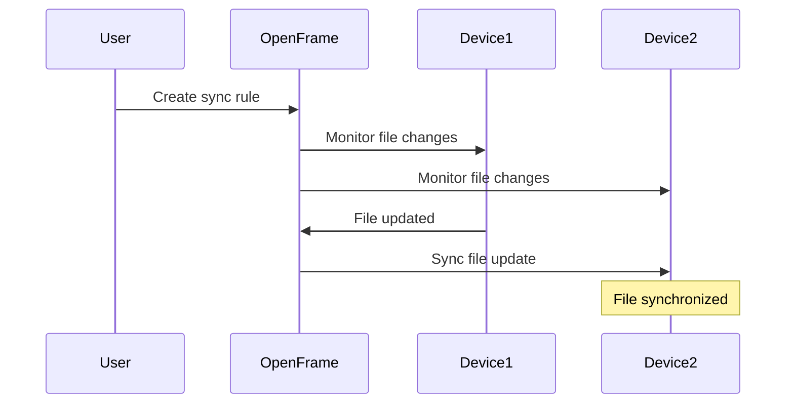

# Common Use Cases Guide

This guide covers the most common ways to use OpenFrame effectively. Each use case includes step-by-step instructions, examples, and best practices to help you get the most out of the platform.

## Overview of OpenFrame Capabilities

OpenFrame excels at:
- **Device Management**: Monitor and control remote devices and systems
- **Data Processing**: Real-time stream processing and analytics
- **File Management**: Remote file operations and synchronization
- **Integration**: Connect with external tools and APIs
- **Monitoring**: Comprehensive system and application monitoring

## Use Case 1: Remote Device Monitoring

**Goal**: Monitor the health and performance of remote devices in real-time.

### What You'll Need
- Devices with network connectivity
- OpenFrame agent installed on target devices
- Dashboard access to OpenFrame

### Step-by-Step Instructions

1. **Install Agent on Target Device**
   ```bash
   # Download the agent for your platform
   curl -L https://your-openframe.com/agent/linux -o openframe-agent
   chmod +x openframe-agent
   
   # Configure the agent
   ./openframe-agent configure --server https://your-openframe.com --token YOUR_TOKEN
   
   # Start monitoring
   ./openframe-agent start
   ```

2. **Configure Monitoring Dashboard**
   - Navigate to **Dashboard** → **Device Monitoring**
   - Click **Add Device Group**
   - Select metrics to monitor (CPU, Memory, Disk, Network)
   - Set alert thresholds

3. **Set Up Alerts**
   - Go to **Alerts** → **Create Rule**
   - Choose device group and metric
   - Define threshold (e.g., CPU > 80%)
   - Select notification method (email, webhook)

### Best Practices
- Group devices by function or location for easier management
- Set graduated alert thresholds (warning at 70%, critical at 90%)
- Use custom metrics for application-specific monitoring

---

## Use Case 2: File Management and Synchronization

**Goal**: Manage files across multiple remote devices and keep them synchronized.

### What You'll Need
- Remote devices with file system access
- Appropriate permissions for file operations
- Network connectivity between devices

### Step-by-Step Instructions

1. **Access File Manager**
   - Navigate to **Devices** → Select device → **File Manager**
   - You'll see a familiar file browser interface

2. **Create New Folders**
   - Click **New Folder** button
   - Enter folder name in the modal dialog
   - Click **Create** to confirm

3. **Rename Files and Folders**
   - Right-click on any file or folder
   - Select **Rename** from context menu
   - Enter new name and press **Enter**

4. **Delete Files Safely**
   - Select files/folders to delete
   - Click **Delete** button
   - Confirm deletion in the safety dialog

5. **Bulk Operations**
   - Use **Ctrl+Click** (Windows/Linux) or **Cmd+Click** (macOS) to select multiple items
   - Available bulk actions: Delete, Move, Copy, Download

### File Synchronization Setup



### Best Practices
- Always test file operations on non-critical data first
- Use the confirmation dialogs to prevent accidental deletions
- Set up regular backup schedules for critical files

---

## Use Case 3: Real-Time Data Analytics

**Goal**: Process and analyze streaming data from multiple sources.

### What You'll Need
- Data sources (APIs, databases, sensors, logs)
- Kafka topics configured for data streams
- Analytics dashboards set up

### Step-by-Step Instructions

1. **Configure Data Sources**
   - Go to **Data Sources** → **Add Source**
   - Choose source type (REST API, Database, File, Kafka)
   - Configure connection parameters
   - Test connection

2. **Set Up Data Processing Pipeline**
   - Navigate to **Stream Processing** → **Create Pipeline**
   - Define data transformations and filtering rules
   - Configure output destinations (database, dashboard, alerts)

3. **Create Analytics Dashboard**
   - Go to **Dashboards** → **Create Dashboard**
   - Add widgets: charts, tables, metrics cards
   - Configure real-time data binding
   - Set refresh intervals

4. **Configure Alerts and Notifications**
   - Define business rules for anomaly detection
   - Set up automated responses to specific conditions
   - Configure notification channels

### Example: IoT Sensor Monitoring
```javascript
// Sample data processing rule
{
  "source": "temperature_sensors",
  "filter": "temperature > 75",
  "actions": [
    {"type": "alert", "severity": "warning"},
    {"type": "dashboard_update", "widget": "temp_chart"},
    {"type": "email", "recipients": ["admin@company.com"]}
  ]
}
```

---

## Use Case 4: System Integration and Automation

**Goal**: Integrate OpenFrame with external tools and automate common workflows.

### Popular Integration Scenarios

| Integration Type | Use Case | Configuration |
|------------------|----------|---------------|
| **Tactical RMM** | Device management | Docker Compose in `integrated-tools/tactical-rmm/` |
| **MeshCentral** | Remote access | Docker Compose in `integrated-tools/meshcentral/` |
| **FleetMDM** | Mobile device management | Docker Compose in `integrated-tools/fleetmdm/` |
| **Authentik** | Identity management | Docker Compose in `integrated-tools/authentik/` |

### Step-by-Step Integration Setup

1. **Choose Integration Tool**
   ```bash
   cd integrated-tools/tactical-rmm/
   # Review and customize docker-compose.yml
   nano docker-compose.yml
   ```

2. **Start External Services**
   ```bash
   docker-compose up -d
   ```

3. **Configure OpenFrame Connection**
   - Go to **Settings** → **Integrations**
   - Add new integration with external service details
   - Test connection and authentication

4. **Set Up Automated Workflows**
   - Create workflow triggers (time-based, event-based)
   - Define actions to perform
   - Test workflow execution

---

## Use Case 5: Multi-Tenant Environment Management

**Goal**: Manage multiple isolated environments for different teams or customers.

### Step-by-Step Instructions

1. **Create Tenant Spaces**
   - Navigate to **Administration** → **Tenants**
   - Click **Add Tenant**
   - Configure isolation settings and resource limits

2. **Set Up User Management**
   - Define roles and permissions per tenant
   - Configure OAuth2/OpenID Connect for authentication
   - Set up user provisioning workflows

3. **Configure Resource Allocation**
   - Assign compute and storage quotas
   - Set up network isolation
   - Configure monitoring and alerting per tenant

### Security Best Practices
- Enable JWT authentication with HTTP-only cookies
- Use role-based access control (RBAC)
- Regularly audit user permissions and access logs
- Implement session timeout policies

---

## Tips and Tricks

### Performance Optimization
- **Batch Operations**: Use bulk operations for multiple files/devices
- **Caching**: Enable Redis caching for frequently accessed data
- **Connection Pooling**: Configure appropriate database connection pools

### Troubleshooting Common Issues

| Issue | Symptoms | Quick Fix |
|-------|----------|-----------|
| **Slow Dashboard Loading** | Widgets take >5 seconds to load | Reduce data query time ranges, enable caching |
| **File Operation Timeouts** | Operations fail with timeout errors | Check network connectivity, increase timeout settings |
| **Missing Device Data** | Devices appear offline | Verify agent configuration and network firewall rules |
| **Authentication Errors** | Login failures or session timeouts | Check JWT configuration and cookie settings |

### Advanced Features

<details>
<summary>Click to expand: Advanced Configuration Options</summary>

#### Custom Metrics Collection
```yaml
# Example custom metric configuration
custom_metrics:
  - name: "application_response_time"
    type: "histogram"
    source: "application_logs"
    pattern: "response_time: (\\d+)ms"
```

#### Webhook Integration
```javascript
// Sample webhook payload for external integrations
{
  "event": "device_alert",
  "device_id": "device_123",
  "alert_type": "high_cpu",
  "timestamp": "2024-01-15T10:30:00Z",
  "data": {
    "cpu_usage": 95.2,
    "threshold": 90.0
  }
}
```
</details>

### Getting More Help

- **API Documentation**: Available at `http://localhost:8080/docs`
- **GraphQL Playground**: Access at `http://localhost:8081/graphql`
- **Health Checks**: Monitor service status at `http://localhost:8080/health`

## Next Steps

After mastering these common use cases, consider:

1. **Advanced Analytics**: Set up machine learning pipelines for predictive analytics
2. **Custom Development**: Build custom plugins or integrations using the OpenFrame APIs
3. **Production Deployment**: Scale your OpenFrame instance using Kubernetes
4. **Security Hardening**: Implement additional security measures for production environments

Each of these use cases can be customized and extended based on your specific requirements. The modular architecture of OpenFrame makes it easy to add new capabilities and integrate with existing systems.