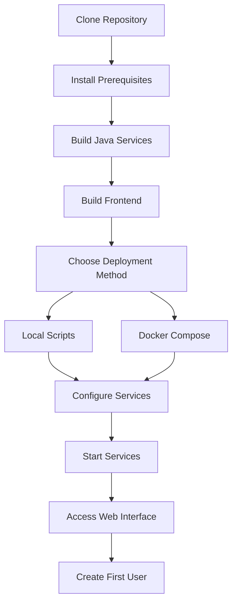

# Getting Started with OpenFrame

Welcome to OpenFrame, a distributed microservices platform designed for device management, data processing, and real-time analytics. This guide will help you set up and start using OpenFrame quickly.

## Prerequisites

Before installing OpenFrame, ensure your system meets the following requirements:

| Requirement | Minimum Version | Recommended | Notes |
|-------------|----------------|-------------|--------|
| **Java** | OpenJDK 21 | Latest LTS | Required for all Java services |
| **Node.js** | 18.0 | Latest LTS | Required for frontend development |
| **npm** | 9.0 | Latest | Package manager for frontend |
| **Docker** | 24.0 | Latest | For containerized deployment |
| **Docker Compose** | 2.0 | Latest | For multi-service orchestration |
| **Memory** | 8GB RAM | 16GB+ RAM | For optimal performance |
| **Storage** | 20GB | 50GB+ | For data and logs |

> **Note**: OpenFrame supports Windows, macOS, and Linux. Platform-specific startup scripts are provided.

## Installation

### 1. Clone the Repository

```bash
git clone https://github.com/your-org/openframe.git
cd openframe
```

### 2. Build the Platform

OpenFrame uses Maven for Java components and npm for frontend components.

```bash
# Build all Java services
mvn clean install

# Skip tests for faster initial build (optional)
mvn clean install -DskipTests
```

### 3. Build the Frontend

```bash
cd openframe/services/openframe-frontend
npm install
npm run build
cd ../../..
```

## Quick Start Setup Process

The following flowchart shows the complete setup process:



## Configuration

### Basic Configuration

1. **Environment Variables**: Copy the example environment file and customize it:
```bash
cp .env.example .env
# Edit .env with your preferred text editor
```

2. **Database Configuration**: OpenFrame uses MongoDB, Cassandra, and Redis. For local development, these can be started using Docker:
```bash
# Navigate to integrated tools directory
cd integrated-tools/
docker-compose up -d mongodb cassandra redis
```

3. **Service Ports**: Default service ports are:
   - Gateway: `8080` (main entry point)
   - API Service: `8081`
   - Frontend: `3000` (development mode)
   - Management: `8082`
   - Config Server: `8888`

## Starting OpenFrame

### Method 1: Platform-Specific Scripts (Recommended)

Choose the script for your operating system:

**macOS:**
```bash
./scripts/run-mac.sh
```

**Linux:**
```bash
./scripts/run-linux.sh
```

**Windows PowerShell:**
```powershell
.\scripts\run-windows.ps1
```

**Silent Mode (no prompts):**
```bash
./scripts/run-mac.sh --silent
```

### Method 2: Manual Service Startup

If you prefer to start services individually:

```bash
# 1. Start Config Server first
cd openframe/services/openframe-config
mvn spring-boot:run

# 2. Start Gateway
cd ../openframe-gateway
mvn spring-boot:run

# 3. Start API Service
cd ../openframe-api
mvn spring-boot:run

# 4. Start Frontend (in development mode)
cd ../openframe-frontend
npm run dev
```

## First Steps

### 1. Access the Web Interface

Once services are running, open your browser and navigate to:
```
http://localhost:8080
```

### 2. Create Your First User Account

1. Click "Sign Up" on the login page
2. Fill in your details:
   - Email address
   - Password (minimum 8 characters)
   - Organization name
3. Click "Create Account"

### 3. Basic Navigation

After logging in, you'll see the main dashboard with:
- **Device Management**: View and manage connected devices
- **Analytics Dashboard**: Real-time metrics and charts
- **Configuration**: System settings and preferences
- **User Management**: Manage team members and permissions

### 4. Connect Your First Device

1. Navigate to "Device Management" → "Add Device"
2. Choose device type (agent-based or API integration)
3. Download the appropriate client agent
4. Follow the device-specific installation instructions

## Common Issues and Solutions

| Issue | Symptom | Solution |
|-------|---------|----------|
| **Port Already in Use** | Service fails to start with "Address already in use" | Check running processes: `lsof -i :8080` and stop conflicting services |
| **Java Version Error** | Build fails with "Unsupported Java version" | Ensure Java 21+ is installed: `java -version` |
| **Memory Issues** | Services crash or become unresponsive | Increase available memory or reduce concurrent services |
| **Database Connection** | "Connection refused" errors | Ensure MongoDB/Cassandra are running: `docker ps` |
| **Frontend Build Error** | npm build fails | Clear cache: `npm cache clean --force` and retry |

### Getting Help

- **Logs**: Check service logs in `logs/` directory
- **Health Check**: Visit `http://localhost:8080/health` to verify service status
- **Documentation**: Refer to the detailed API documentation at `http://localhost:8080/docs`

## Next Steps

Now that OpenFrame is running, you can:

1. **Explore Common Use Cases**: Check out our [Common Use Cases Guide](common-use-cases.md) for practical examples
2. **Configure Integrations**: Set up connections to external tools and systems
3. **Customize Dashboards**: Create custom views for your specific monitoring needs
4. **Scale Up**: Learn about production deployment options

> **Pro Tip**: Use the silent mode startup script (`--silent`) for automated deployments and CI/CD pipelines.

## Support

If you encounter issues not covered in this guide:
- Check the troubleshooting section in each service's documentation
- Review logs for error details
- Consult the community forums or support channels

Welcome to OpenFrame! You're now ready to start managing devices and processing data with our powerful platform.