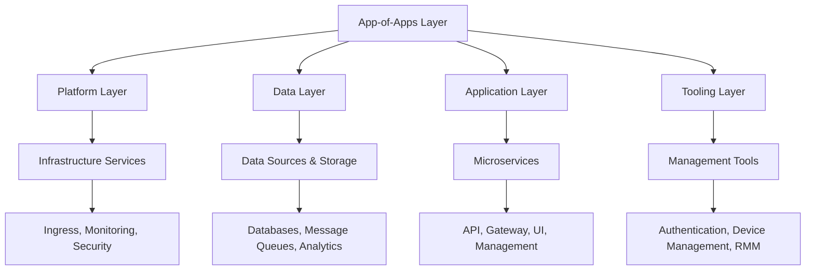

# OpenFrame Kubernetes Manifests

This directory contains the complete Kubernetes deployment configuration for the OpenFrame platform, organized in a layered architecture that supports both local development (Kind) and production deployments.

## Architecture Overview

The OpenFrame platform follows a **layered deployment architecture** with clear separation of concerns:



## Directory Structure & Purpose

### 🎯 **App-of-Apps Layer** (`app-of-apps/`)
**Purpose**: GitOps deployment orchestration using ArgoCD
- **`Chart.yaml`**: Helm chart definition for the entire platform
- **`templates/`**: ArgoCD application definitions and project configurations
- **`values.yaml`**: Global configuration values for all applications

**Key Components**:
- ArgoCD application definitions for each layer
- Project and namespace configurations
- Docker registry secrets management

### 🏗️ **Platform Layer** (`platform/`)
**Purpose**: Core infrastructure and observability services
- **`ingress-nginx/`**: Kubernetes ingress controller
- **`cert-manager/`**: SSL/TLS certificate management
- **`grafana/`**: Metrics visualization and dashboards
- **`prometheus/`**: Metrics collection and alerting
- **`loki/`**: Log aggregation and querying
- **`promtail/`**: Log shipping agent
- **`ngrok-operator/`**: Secure tunnel management

**Deployment Order**: 1st (required by all other layers)

### 💾 **Data Layer** (`datasources/`)
**Purpose**: Data storage, messaging, and analytics infrastructure
- **`mongodb/`**: Document database with monitoring
- **`cassandra/`**: Distributed NoSQL database
- **`redis/`**: In-memory cache and session store
- **`kafka/`**: Distributed streaming platform
- **`zookeeper/`**: Distributed coordination service
- **`pinot/`**: Real-time analytics database
- **`debezium-connect/`**: Change data capture
- **`redis-exporter/`**, **`mongodb-exporter/`**: Monitoring exporters

**Deployment Order**: 2nd (required by microservices)

### 🔧 **Application Layer** (`microservices/`)
**Purpose**: Core OpenFrame business logic and APIs
- **`openframe-api/`**: Main REST API service
- **`openframe-gateway/`**: API gateway and routing
- **`openframe-management/`**: System management interface
- **`openframe-stream/`**: Real-time data streaming service
- **`openframe-config/`**: Configuration management service
- **`openframe-client/`**: Client-side application logic
- **`openframe-ui/`**: Web user interface
- **`external-api/`**: External API integrations
- **`namespace/`**: Application namespace configuration

**Deployment Order**: 3rd (depends on data layer)

### 🛠️ **Tooling Layer** (`integrated-tools/`)
**Purpose**: Enterprise management and security tools
- **`authentik/`**: Identity and access management
- **`fleetmdm/`**: Device management and MDM
- **`meshcentral/`**: Remote device management
- **`tactical-rmm/`**: Remote monitoring and management
- **`namespace/`**: Tooling namespace configuration

**Deployment Order**: 4th (optional, depends on platform layer)

### 🎨 **Client Tools Layer** (`client-tools/`)
**Purpose**: Development and operational tooling
- **`kafka-ui/`**: Kafka management interface
- **`mongo-express/`**: MongoDB administration interface
- **`debezium-ui/`**: Debezium monitoring interface
- **`telepresence/`**: Local development proxy
- **`namespace/`**: Client tools namespace configuration

**Deployment Order**: 5th (optional, for development/operations)

### 📦 **Apps Layer** (`apps/`)
**Purpose**: Application-level Helm chart definitions
- **`Chart.yaml`**: Application chart definition
- **`templates/`**: Application-specific templates
- **`values.yaml`**: Application configuration values

## Deployment Strategy

### GitOps Approach
The platform uses **ArgoCD** for GitOps deployment management:
- All configurations are version-controlled
- Automatic synchronization with Git repository
- Declarative deployment state management
- Rollback capabilities

### Layered Deployment
Deployments follow a strict dependency order:

1. **Platform Layer** → Core infrastructure
2. **Data Layer** → Storage and messaging
3. **Application Layer** → Business logic
4. **Tooling Layer** → Management tools
5. **Client Tools Layer** → Operational tools

### Environment Support
- **Development**: Kind cluster with local resources
- **Production**: Full Kubernetes cluster with enterprise resources
- **Hybrid**: Mixed deployment strategies

## Key Features

### 🔐 **Security**
- Certificate management with cert-manager
- Identity management with Authentik
- Secure ingress with nginx
- Namespace isolation

### 📊 **Observability**
- Metrics collection with Prometheus
- Log aggregation with Loki
- Visualization with Grafana
- Distributed tracing support

### 🔄 **Scalability**
- Horizontal pod autoscaling
- Database clustering
- Message queue partitioning
- Load balancing

### 🚀 **Development Experience**
- Local development with Kind
- Hot reloading with Telepresence
- Management UIs for all components
- Comprehensive monitoring

## Getting Started

### Prerequisites
```bash
# Required tools
kubectl
helm
docker
kind (for local development)

# Environment variables
export GITHUB_TOKEN_CLASSIC=your_github_token
```

### Quick Start (Local Development)
```bash
# Bootstrap complete platform
./scripts/run.sh b

# Or step-by-step deployment
./scripts/run.sh u                    # Create Kind cluster
./scripts/manage-apps.sh list         # List available apps
./scripts/manage-apps.sh deploy platform/ingress-nginx
./scripts/manage-apps.sh deploy platform/grafana
./scripts/manage-apps.sh deploy datasources/mongodb
./scripts/manage-apps.sh deploy microservices/openframe-api
```

### Production Deployment
```bash
# Deploy ArgoCD application-of-applications
helm install openframe-apps ./app-of-apps

# ArgoCD will automatically deploy all layers
# Monitor deployment status in ArgoCD UI
```

## Monitoring & Management

### Access Points
- **ArgoCD**: `https://argocd.localhost` (deployment management)
- **Grafana**: `https://grafana.localhost` (metrics & logs)
- **Kafka UI**: `https://kafka-ui.localhost` (message queue management)
- **Mongo Express**: `https://mongo-express.localhost` (database management)
- **OpenFrame UI**: `https://openframe.localhost` (main application)

### Health Checks
```bash
# Check all pods
kubectl get pods -A

# Check ArgoCD applications
kubectl get applications -n argocd

# Check ingress status
kubectl get ingress -A
```

## Troubleshooting

### Common Issues
1. **Resource constraints**: Increase Kind cluster resources
2. **Image pull errors**: Verify GitHub token and registry access
3. **Service connectivity**: Check namespace and service configurations
4. **Storage issues**: Verify persistent volume claims

### Debug Commands
```bash
# View application logs
kubectl logs -n <namespace> <pod-name>

# Check service endpoints
kubectl get endpoints -A

# Verify configuration
kubectl describe configmap -n <namespace> <config-name>

# Port forward for local access
kubectl port-forward -n <namespace> <pod-name> <local-port>:<pod-port>
```

## Contributing

When adding new components:

1. **Follow the layered architecture** - place components in appropriate layers
2. **Update dependencies** - modify ArgoCD application definitions
3. **Add monitoring** - include Prometheus metrics and Loki logging
4. **Document changes** - update this README and component documentation
5. **Test thoroughly** - verify in both Kind and production environments

## Architecture Benefits

- **Modularity**: Each layer can be deployed independently
- **Scalability**: Components can scale horizontally
- **Maintainability**: Clear separation of concerns
- **Observability**: Comprehensive monitoring and logging
- **Security**: Multi-layered security approach
- **Flexibility**: Support for multiple deployment environments
