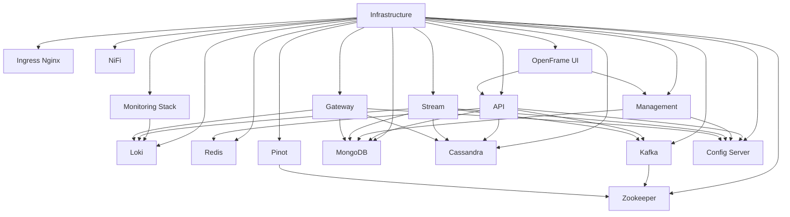
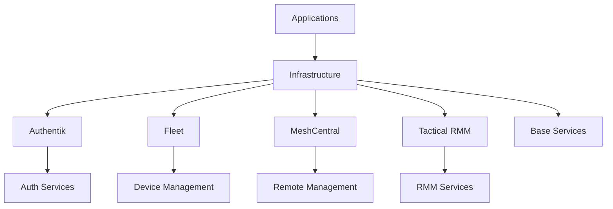

# OpenFrame Kubernetes Cluster

This directory contains the Kubernetes cluster configuration and deployment scripts for the OpenFrame platform using Kind (Kubernetes in Docker).

## Overview

The OpenFrame platform consists of several components organized into different namespaces:

1. Infrastructure (base components)
2. Authentik (authentication service)
3. Fleet (device management)
4. MeshCentral (remote management)
5. Tactical RMM (remote monitoring and management)

## Infrastructure Components

The infrastructure namespace contains the following core components:



## Application Dependencies



## Deployment Order

1. Infrastructure components (base services)
2. Authentik (authentication)
3. Fleet (device management)
4. MeshCentral (remote management)
5. Tactical RMM (remote monitoring)

## Prerequisites

- Kubernetes cluster (Kind)
- `kubectl` CLI
- `helm` CLI
- GitHub Container Registry (ghcr.io) access token (Environment variable: `GITHUB_TOKEN_CLASSIC`)

## Deployment Scripts

The deployment is managed through the following scripts:

- `run.sh`: Main deployment script for bootstrapping the cluster and deploying all components
- `kind-cluster/scripts/kind-cluster.sh`: Kind cluster management script
- `kind-cluster/scripts/deploy-apps.sh`: Reference script showing component dependencies

## Component Versions

Key component versions:

- Ingress Nginx: 4.12.0
- Prometheus Stack: 69.8.2
- Redis: 20.11.3
- Kafka: 31.5.0
- MongoDB: Latest
- Cassandra: 12.2.1
- Authentik: Latest

## Directory Structure

```bash
kind-cluster/
├── apps/
│   ├── infrastructure/    # Base infrastructure components
│   ├── authentik/        # Authentication service
│   ├── fleet/           # Device management
│   ├── meshcentral/     # Remote management
│   └── tactical-rmm/    # Remote monitoring
├── scripts/             # Deployment and management scripts
└── README.md           # This file
```

## Getting Started

1. Set up your environment:

   ```bash
   export GITHUB_TOKEN_CLASSIC=your_github_token
   ```

2. Bootstrap the cluster and deploy components:

   ```bash
   ./run.sh b
   ```

   This will:
   - Create the Kind cluster
   - Deploy infrastructure components
   - Deploy all applications in the correct order

**NOTE:**

To boostrap cluster and deploye only required app follow these steps:

```bash
# Bootstrap kubernetes cluster
./run.sh u

# List deployable apps
./run.sh a

# Deploy ingress and montoring as it is required by all apps
./run.sh a ingress-nginx
./run.sh a grafana
./run.sh a loki
./run.sh a promtail

# Deploy needed app
./run.sh a rmm
```

## Monitoring and Management

- Grafana dashboards are available for monitoring
- Prometheus and Loki for metrics and logs
- Kafka UI for message queue management
- Mongo Express for database management
- NiFi for data flow management

## Troubleshooting

1. Check pod status:

   ```bash
   kubectl get pods -A
   ```

2. View logs:

   ```bash
   kubectl logs -n <namespace> <pod-name>
   ```

3. Check service status:

   ```bash
   kubectl get svc -A
   ```

## Contributing

Please follow the project's contribution guidelines when submitting changes to this repository.
