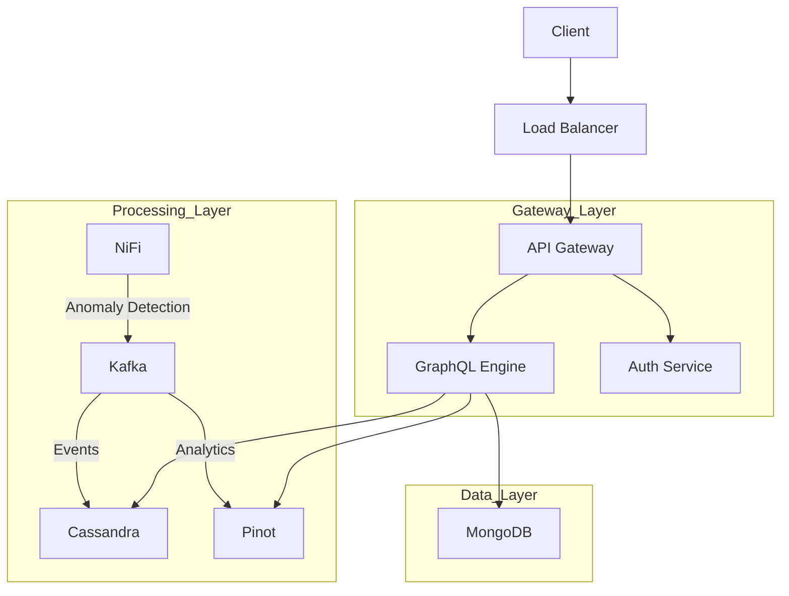
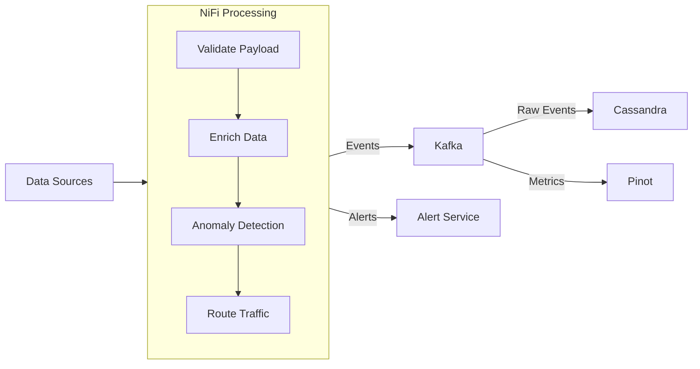

# OpenFrame

OpenFrame is a distributed platform built on a microservices architecture, designed to unify multiple open-source tools under one cohesive system while maintaining high scalability and resilience.

-------------------------------------------------------------------------------
## Key Features
-------------------------------------------------------------------------------
• High scalability and resilience with containerized microservices.  
• Unified authentication and single sign-on for integrated third-party tools (via the Gateway).  
• Stream-oriented data ingestion (NiFi/Kafka) plus flexible data layers (MongoDB, Cassandra, Pinot).  
• Comprehensive observability with Prometheus, Grafana, and Loki.

-------------------------------------------------------------------------------
## Quick Start
-------------------------------------------------------------------------------
(If you have a more detailed install guide, link or expand here.)

1. Clone the repo and ensure Docker/Docker Compose are installed.  
2. Stand up core infrastructure (databases, Kafka, etc.)  
   » docker-compose -f docker-compose.openframe-infrastructure.yml up -d  
3. (Optional) Start microservices individually or use scripts/build-and-run.sh to orchestrate everything.  
4. Access UI or Gateway (and integrated dashboards/tools) via exposed URLs.

-------------------------------------------------------------------------------
## Repository Layout
-------------------------------------------------------------------------------
• config/ – Central YAML configurations for each microservice (API, Gateway, Management, Stream).  
• docker-compose.* – Docker Compose files for various service bundles (infrastructure, integrated tools, etc.).  
• infrastructure/ – Custom Dockerfiles/scripts for specialized services (like Cassandra or NiFi).  
• libs/ – Shared libraries (openframe-core, openframe-data) used across microservices.  
• monitoring/ – Prometheus, Grafana, and alerting configs/dashboards.  
• scripts/ – Automation scripts (e.g., build-and-run.sh).  
• services/ – Main microservices (API, Gateway, Stream, UI).

-------------------------------------------------------------------------------
## Contributing
-------------------------------------------------------------------------------
• See CONTRIBUTING.md for guidelines.  
• Pull requests should include tests for new features or bugfixes.  
• GitHub Actions CI is provided for automated builds and test coverage.

-------------------------------------------------------------------------------
## License
-------------------------------------------------------------------------------
• See LICENSE for licensing details.

-------------------------------------------------------------------------------
## Further Documentation
-------------------------------------------------------------------------------
• Each microservice has its own README (see services/ subfolders).  
• Additional architecture details below, or in docs/ if you keep a separate folder.  

-------------------------------------------------------------------------------
# OpenFrame Complete Architecture and Implementation Guide
-------------------------------------------------------------------------------
Below is a detailed, technical overview of OpenFrame’s architecture, data flows, and deployments.

## Table of Contents
1. System Overview  
2. Data Flows and System Architecture  
3. Core Components  
4. GraphQL Implementation  
5. Service Implementations  
6. Database Architecture  
7. Analytics with Apache Pinot  
8. Security Implementation  
9. Deployment and Observability  
10. Future Enhancements  

-------------------------------------------------------------------------------
## 1. System Overview
-------------------------------------------------------------------------------

### 1.1 Architecture
OpenFrame is a distributed platform built on a microservices architecture, designed for high scalability and resilience. Key components:
- API Gateway with unified GraphQL interface  
- Event-driven stream processing with NiFi and Kafka  
- Multi-layered data storage:  
  • MongoDB for application data  
  • Cassandra for event storage  
  • Apache Pinot for analytics  
- Service mesh for inter-service communication  
- Containerized deployment (Docker, Kubernetes)

### 1.2 Technology Stack

#### Core Technologies
• Backend: Spring Boot 3.2.x, OpenJDK 21  
• API: GraphQL (Netflix DGS or similar)  
• Stream Processing: Apache NiFi 2.0  
• Databases:  
  • MongoDB 7.x (application data)  
  • Cassandra 4.x (event storage)  
  • Apache Pinot 1.0.0 (analytics)  
• Message Queue: Apache Kafka 3.6  
• Service Mesh: Istio 1.20  
• Observability: Prometheus, Grafana, Loki  

#### Development Requirements
• OpenJDK 21.0.1+  
• Maven 3.9.6+  
• Docker 24.0+ and Docker Compose 2.23+  
• Kubernetes 1.28+  
• Git 2.42+  

### 1.3 System Requirements (Example)
```yaml
requirements:
  performance:
    latency: 
      graphql_queries: < 200ms
      analytics_queries: < 500ms
      stream_processing: < 100ms
    throughput: 100,000 events/second
    availability: 99.99%
  scaling:
    users: 10,000+ concurrent
    data_volume: 1TB+/day
    retention: 1-7 years
  compliance:
    data_encryption: AES-256
    authentication: OAuth 2.0 + JWT
    audit_logging: Enabled
```

-------------------------------------------------------------------------------
## 2. Data Flows and System Architecture
-------------------------------------------------------------------------------

### 2.1 High-Level Architecture


### 2.2 Stream Processing Flow


### 2.3 Data Processing Rules
```yaml
nifi_processors:
  validation:
    - schema_validation
    - data_type_check
    - required_fields
  
  enrichment:
    - geo_location
    - tenant_context
    - metadata_injection
  
  anomaly_detection:
    rules:
      - type: threshold
        metrics: ["response_time", "error_rate"]
        window: 5m
      - type: zscore
        metrics: ["transaction_volume"]
        threshold: 3
    actions:
      - alert
      - tag_event
      - route_to_investigation

  routing:
    - condition: "event.type == 'metric'"
      destination: "pinot"
    - condition: "event.type == 'log'"
      destination: "cassandra"
    - condition: "event.priority == 'high'"
      destination: "alerts"
```

### 2.4 Data Storage Strategy
```yaml
storage_strategy:
  mongodb:
    purpose: "Application data and configurations"
    data_types:
      - user_profiles
      - tenant_configs
      - system_settings
    access_patterns:
      - flexible_queries
      - CRUD_operations
      
  cassandra:
    purpose: "Event and time-series storage"
    data_types:
      - system_events
      - audit_logs
      - metrics
    access_patterns:
      - time_range_queries
      - high_write_throughput
      
  pinot:
    purpose: "Real-time analytical queries"
    data_types:
      - aggregated_metrics
      - user_behavior_analytics
    access_patterns:
      - OLAP-style queries
      - rollups
```

-------------------------------------------------------------------------------
## 3. Core Components
-------------------------------------------------------------------------------
(This section often overviews the main services and what they do, e.g., openframe-api, openframe-gateway, etc.)

• openframe-gateway: Auth proxy and unified entry point for multiple open-source tools and microservices.  
• openframe-api: GraphQL/REST layer that implements main business logic.  
• openframe-stream: Data ingestion and pipeline management (NiFi/Kafka).  
• openframe-management: Possibly an admin or orchestrator service for internal tasks.  
• openframe-ui: Front-end interface for user interactions, tool management, etc.

-------------------------------------------------------------------------------
## 4. GraphQL Implementation
-------------------------------------------------------------------------------
• GraphQL often sits in openframe-api or openframe-gateway.  
• Potentially uses Netflix DGS or similar libraries.  
• Can incorporate schema federation if multiple services define sub-schemas.

-------------------------------------------------------------------------------
## 5. Service Implementations
-------------------------------------------------------------------------------
• Each microservice has a README with run instructions, Dockerfiles, or config files.  
• Typically includes Spring Boot code (Java classes, pom.xml, etc.) or Node-based code (package.json) for the UI.

-------------------------------------------------------------------------------
## 6. Database Architecture
-------------------------------------------------------------------------------
• MongoDB for flexible, schema-less data such as user profiles or tenant config.  
• Cassandra for high-throughput event ingestion and time-series.  
• Pinot for real-time analytical queries.  
• Relational DBs (MySQL/PostgreSQL) may appear for certain third-party integrations (e.g., Fleet, Authentik).

-------------------------------------------------------------------------------
## 7. Analytics with Apache Pinot
-------------------------------------------------------------------------------
• Pinot ingests real-time data from Kafka and provides near sub-second query latencies.  
• Ideal for operational dashboards or analytic queries that require real-time results.  
• Accessed typically by openframe-api or openframe-ui for analytics components.

-------------------------------------------------------------------------------
## 8. Security Implementation
-------------------------------------------------------------------------------
• OAuth 2.0 + JWT for authentication flows.  
• The openframe-gateway enforces authentication before proxying requests to integrated UIs.  
• Could also use a service mesh’s mutual TLS for internal traffic.  
• Data encryption at rest and in transit (TLS, AES-256).

-------------------------------------------------------------------------------
## 9. Deployment and Observability
-------------------------------------------------------------------------------
• Containerized with Docker, orchestrated by Docker Compose or Kubernetes for production.  
• Observability stack:  
  • Prometheus for metrics.  
  • Grafana with custom dashboards for each service.  
  • Loki for centralized logging.  
• Potential Alertmanager rules for high error rates, slow queries, NiFi backpressure, etc.

### 9.5 Alerting Rules (Example)
```yaml
apiVersion: monitoring.coreos.com/v1
kind: PrometheusRule
metadata:
  name: openframe-alerts
spec:
  groups:
    - name: openframe.rules
      rules:
        - alert: HighErrorRate
          expr: |
            sum(rate(graphql_errors_total[5m])) 
            / 
            sum(rate(graphql_requests_total[5m])) > 0.05
          for: 5m
          labels:
            severity: critical
          annotations:
            summary: High GraphQL error rate

        - alert: SlowQueries
          expr: |
            histogram_quantile(0.95, sum(rate(graphql_query_duration_seconds_bucket[5m])) by (le)) > 1
          for: 5m
          labels:
            severity: warning

        - alert: NiFiBackpressure
          expr: |
            nifi_backpressure_bytes_threshold_exceeded > 0
          for: 15m
          labels:
            severity: warning

        - alert: PinotQueryLatency
          expr: |
            histogram_quantile(0.95, sum(rate(pinot_query_latency_ms_bucket[5m])) by (le)) > 1000
          for: 5m
          labels:
            severity: warning
```

-------------------------------------------------------------------------------
## 10. Future Enhancements
-------------------------------------------------------------------------------
Features on the roadmap for upcoming releases:

### 10.1 Planned Features
```yaml
roadmap:
  2024_Q1:
    api_improvements:
      - GraphQL Subscriptions for real-time updates
      - Enhanced batching and caching
      - Automated schema documentation
      - Query complexity analysis

    streaming_enhancements:
      - Advanced NiFi processors for ML inference
      - Real-time anomaly detection improvements
      - Custom processors for domain-specific transformations

    analytics_features:
      - Advanced Pinot aggregations
      - Real-time dashboards
      - Predictive analytics integration
      - Custom OLAP cubes

  2024_Q2:
    scalability:
      - Multi-region deployment
      - Cross-region replication
      - Advanced caching strategies
      - Query federation

    security:
      - Zero-trust architecture
      - Enhanced audit capabilities
      - Automated compliance reporting
      - Advanced threat detection

    observability:
      - Enhanced tracing
      - Custom metrics
      - Automated capacity planning
      - Performance optimization tools
```

### 10.2 Technical Debt and Improvements
```yaml
improvements:
  infrastructure:
    - Upgrade dependencies
    - Optimize resource usage
    - Improve deployment automation
    - Enhanced backup strategies

  code_quality:
    - Increase test coverage
    - Implement more design patterns
    - Improve error handling
    - Enhanced documentation

  monitoring:
    - Custom monitoring solutions
    - Advanced alerting rules
    - Improved debugging tools
    - Enhanced logging
```

### 10.3 Research Areas
```yaml
research:
  machine_learning:
    - Automated anomaly detection
    - Predictive scaling
    - Query optimization
    - Pattern recognition

  streaming:
    - Enhanced real-time processing
    - Custom NiFi processors
    - Advanced routing strategies
    - Optimization techniques

  analytics:
    - New Pinot features
    - Custom aggregations
    - Real-time analytics
    - Advanced visualizations
```

-------------------------------------------------------------------------------
## Documentation or Additional Guides
-------------------------------------------------------------------------------
• If you have a separate docs/ folder, link it here or consolidate further.  
• Larger diagrams, usage instructions, or specific code examples can be added as dedicated markdown pages.
