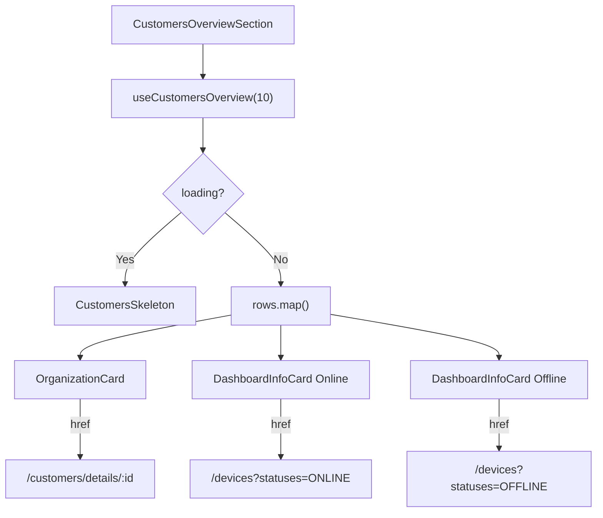

<!-- source-hash: f4ffe816306ab8a501ecefca81bcc8b3 -->
Renders a paginated customers overview section displaying organization cards alongside online/offline device metrics for each customer.

## Key Components

- **`CustomersSkeleton`** — Internal loading skeleton that renders 3 placeholder rows, each with organization card and two device metric card shapes
- **`CustomersOverviewSection`** — Main exported component that fetches and renders up to 10 customer organizations with their device health stats

## Usage Example

```typescript
// pages/dashboard.tsx or any server/client layout
import { CustomersOverviewSection } from './customers-overview';

export default function DashboardPage() {
  return (
    <main>
      <CustomersOverviewSection />
    </main>
  );
}
```

## Data Flow



## Behavior Notes

- Fetches the first **10 organizations** via `useCustomersOverview`
- Each row is a responsive 3-column grid: organization info, online devices, offline devices
- Device metric cards link to `/devices` pre-filtered by `organizationId` and status; if count is `0`, the status filter is omitted
- Displays total customer count below the section heading; shows a skeleton placeholder while loading
- Error state renders an inline error message styled with ODS error tokens