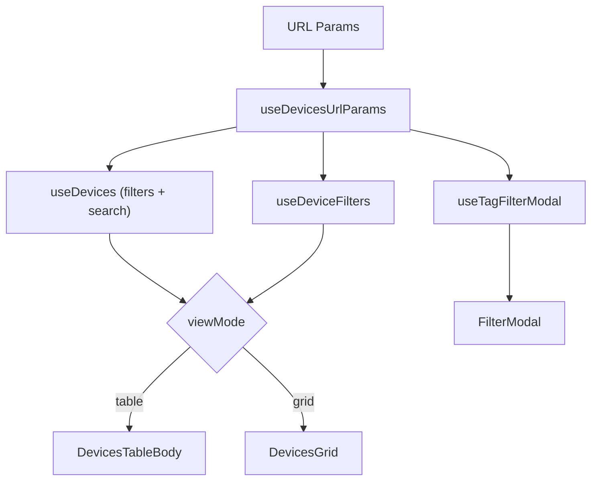

<!-- source-hash: 3c890b7fba28b84a4d930401317edbe9 -->
Primary view component for the Devices section, rendering either a table or grid layout with search, filtering, and infinite scroll capabilities.

## Key Components

### `DevicesView`

Main exported component that composes the full devices page. Marked with a TODO for deletion after `DevicePanel` testing completes.

**Hooks consumed:**

| Hook | Purpose |
|------|---------|
| `useDevicesUrlParams` | Manages URL-synced search, filters, tags, and view mode |
| `useDevices` | Fetches paginated device data with infinite scroll support |
| `useDeviceFilters` | Loads available filter options (status, OS, org) |
| `useTagFilterModal` | Controls the `FilterModal` open state and tag/filter state |
| `useGridInfiniteScroll` | Triggers `fetchNextPage` via IntersectionObserver in grid mode |

**View modes:**

- `table` — Renders `DevicesTableBody` with column filters, row actions, and an `InfiniteFooter` load-more control
- `grid` — Renders `DevicesGrid` with a sentinel ref for automatic infinite scroll

## Usage Example

```typescript
// Rendered via Next.js App Router page
import { DevicesView } from '@/features/devices/components/devices-view';

export default function DevicesPage() {
  return <DevicesView />;
}
```

## Data Flow

