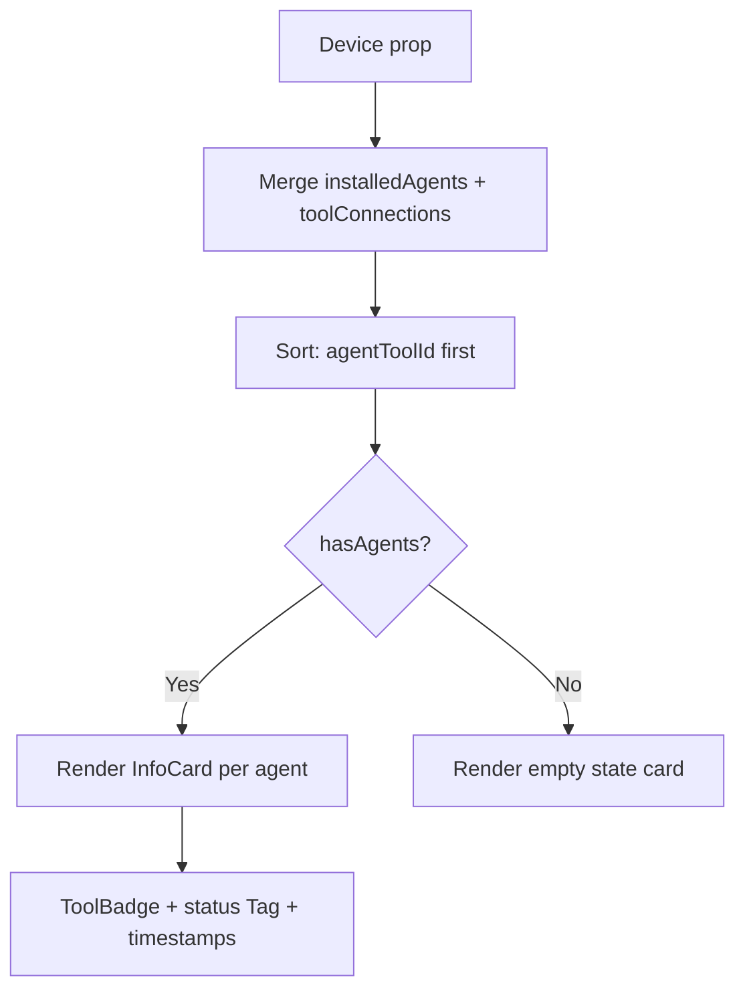

<!-- source-hash: 694eee969ae1a956e8a12a2b42c1ce39 -->
Renders the **Agents** tab on a device detail page, merging `installedAgents` and `toolConnections` data into a unified grid of agent cards with status, timestamps, and tool branding.

## Key Components

- **`AgentsTab`** — Main exported component. Accepts a `Device` prop and renders a responsive card grid.
- **`agentTypeToToolType`** — Mapping from raw agent type strings (e.g. `fleetmdm-agent`) to normalized tool type keys (e.g. `FLEET_MDM`).
- **`AGENT_TYPES_WITH_STATUS`** — Set of tool types (`TACTICAL_RMM`, `FLEET_MDM`, `MESHCENTRAL`) that support online/offline status display.
- **`getAgentDisplayStatus`** — Resolves a normalized `online | offline` status from a raw status string, dispatching by tool type.
- **`combinedAgents`** — Runtime-merged list of agents, deduplicating across `installedAgents` and `toolConnections`, sorted to show connected agents (with `agentToolId`) first.

## Usage Example

```typescript
import { AgentsTab } from './agents-tab';
import type { Device } from '../../types/device.types';

const device: Device = {
  toolConnections: [
    { toolType: 'TACTICAL_RMM', agentToolId: 'abc-123', status: 'online', lastSeen: '...', lastFetched: '...' },
  ],
  installedAgents: [
    { agentType: 'tacticalrmm-agent', version: '0.19.0' },
  ],
};

<AgentsTab device={device} />
```

## Rendering Logic



Each card displays a `ToolBadge`, optional `Tag` for online/offline status, last seen/fetched timestamps, agent ID (copyable), and version — only for tool types that support status tracking.