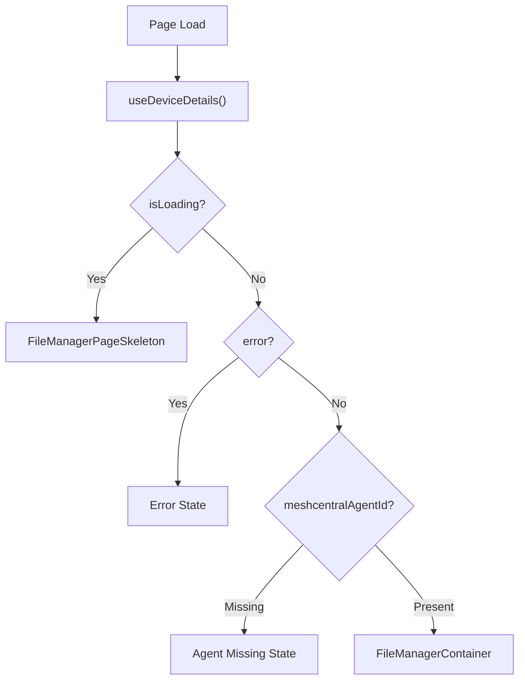

<!-- source-hash: 4dfb5265d405c054eb899778c7b68a20 -->
Next.js page component that renders the File Manager feature for a specific device, handling loading, error, and missing MeshCentral agent states before displaying the full file manager interface.

## Key Components

- **`FileManagerPage`** — Default export; resolves route params, fetches device details, and conditionally renders loading/error/content states
- **`FileManagerPageSkeleton`** — Internal skeleton component shown during data fetching, wraps `FileManagerSkeleton` in the page layout
- **`useDeviceDetails`** — Hook used to fetch device data (polling disabled)
- **`getMeshCentralAgentId`** — Utility that extracts the MeshCentral agent ID required for file manager functionality
- **`useSafeBack`** — Hook providing a back navigation handler that falls back to the device details route

## Usage Example

```typescript
// Accessed via route: /devices/details/[deviceId]/file-manager
// No manual instantiation needed — Next.js handles routing

// The page resolves params and renders one of four states:
// 1. Loading  → FileManagerPageSkeleton
// 2. Error    → Error message + "Return to Device Details" button
// 3. No agent → MeshCentral agent missing message + back button
// 4. Success  → <FileManagerContainer> with deviceId, agentId, hostname
```

## State Flow

