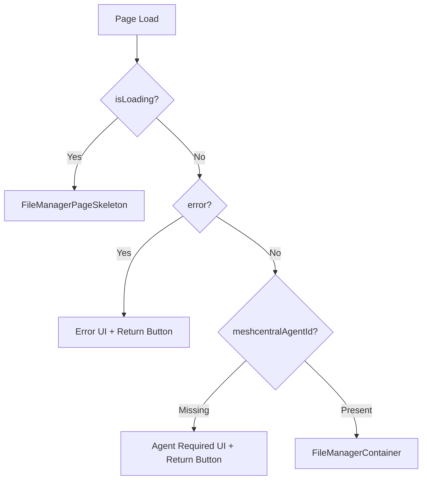

<!-- source-hash: 4dfb5265d405c054eb899778c7b68a20 -->
The device File Manager page component that handles loading, error, and missing-agent states before rendering the `FileManagerContainer` for a given device.

## Key Components

| Export / Symbol | Description |
|---|---|
| `FileManagerPage` (default) | Next.js page component that resolves `deviceId` from async params, fetches device details, and conditionally renders the file manager or an appropriate fallback UI |
| `FileManagerPageSkeleton` | Internal loading skeleton wrapper using `DetailPageContainer` + `FileManagerSkeleton` |
| `PAGE_PADDING` | Shared Tailwind padding constant applied consistently across all render states |

## Render States



## Usage Example

```typescript
// Next.js app router — automatically receives async params
// Route: /devices/details/[deviceId]/file-manager

// params resolves to: { deviceId: "abc-123" }
<FileManagerPage params={Promise.resolve({ deviceId: 'abc-123' })} />
```

The component resolves async `params` via React's `use()`, then:
1. Fetches device details (polling disabled) via `useDeviceDetails`
2. Extracts the `meshcentralAgentId` using `getMeshCentralAgentId`
3. Falls back to `useSafeBack` for navigation — returns to `/devices/details/:deviceId` on back

> **Note:** The File Manager requires an active MeshCentral agent. If `meshcentralAgentId` is absent, the page renders an informational error rather than attempting to load the file manager UI.