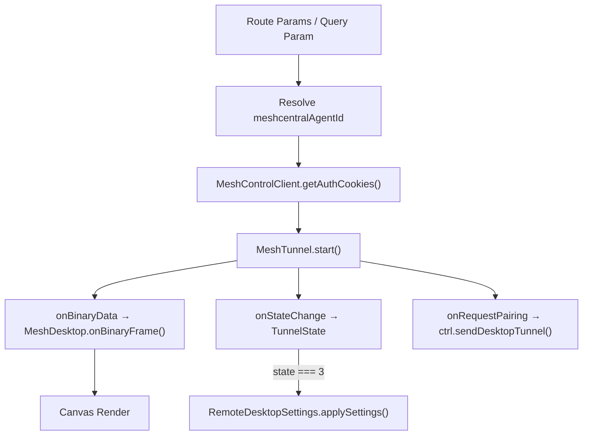

<!-- source-hash: efeb0b0d06db7f77e09f0490c9312f65 -->
Client-side Next.js page component that renders an interactive remote desktop session for a managed device using the MeshCentral protocol. It handles tunnel lifecycle, display management, clipboard synchronization, fullscreen toggling, and reconnection logic.

## Key Components

- **`RemoteDesktopPage`** — Default export; the main page component accepting a `deviceId` route param
- **`MeshTunnel`** — WebSocket tunnel managing connection state (`TunnelState`) with auto-reconnect callbacks
- **`MeshDesktop`** — Canvas-based renderer that processes binary frames and manages display list changes
- **`MeshControlClient`** — REST/WebSocket control client used to obtain auth cookies, open sessions, and relay clipboard/power commands
- **`RemoteDesktopSettings`** — Applies persistent display/encoding settings over an active tunnel
- **`createActionsMenuGroups`** / **`RemoteSettingsModal`** — UI helpers for the actions dropdown and settings panel

## State & Refs

| State/Ref | Purpose |
|-----------|---------|
| `tunnelRef` / `controlRef` / `desktopRef` | Stable references to long-lived objects across renders |
| `state` (`TunnelState`) | Tracks connection phase (0 = closed, 1 = lost, 3 = connected) |
| `firstFrameReceived` | Controls loading skeleton visibility |
| `clipboardEnabled` | Toggles bidirectional clipboard sync via `setClipboardInterceptor` |
| `isFullscreen` | Mirrors `document.fullscreenElement` via event listener |
| `displays` / `currentDisplay` | Multi-monitor support from MeshCentral display list |

## Usage Example

```typescript
// Rendered automatically by Next.js at:
// /devices/[deviceId]/remote-desktop

// Legacy backward-compat: pass serialized device data via query param
// /devices/[deviceId]/remote-desktop?deviceData={"meshcentralAgentId":"node//abc123","hostname":"DESKTOP-01"}

// Route params are resolved with React.use() for async params support
export default function RemoteDesktopPage({ params }: RemoteDesktopPageProps) {
  const resolvedParams = use(params); // React 19 async params
  const deviceId = resolvedParams.deviceId;
  // ...
}
```

## Data Flow

