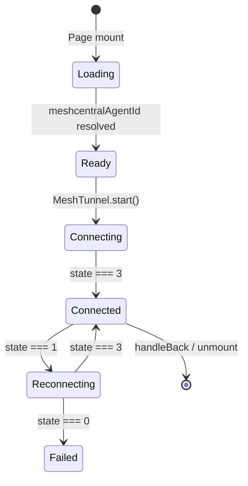

<!-- source-hash: efeb0b0d06db7f77e09f0490c9312f65 -->
Remote desktop page component for MeshCentral-based remote device control, providing live canvas rendering, tunnel management, clipboard sync, display selection, fullscreen support, and settings configuration.

## Key Components

- **`RemoteDesktopPage`** — Default export; top-level Next.js page component rendered at `/devices/[deviceId]/remote-desktop`
- **`LegacyDeviceData`** — Interface supporting backward-compatible `?deviceData=` query param for pre-fetched device info
- **`useDeviceDetails`** — Internal hook that fetches device data when no legacy param is provided
- **`MeshTunnel`** — Manages the WebSocket tunnel to the MeshCentral relay; handles reconnection, binary frames, and state transitions
- **`MeshDesktop`** — Attaches to a `<canvas>` element and decodes/renders incoming binary frames; exposes display list and clipboard interceptor hooks
- **`MeshControlClient`** — REST/session client for auth cookies, clipboard get/set, and dispatching desktop tunnel pairing requests
- **`RemoteDesktopSettings`** — Applies quality/encoding settings to an active tunnel on connection state `3` (connected)
- **`createActionsMenuGroups`** — Builds the actions dropdown entries (power, display switching, clipboard toggle, etc.)
- **`RemoteSettingsModal`** — Modal for editing `RemoteSettingsConfig` at runtime

## Usage Example

```typescript
// Next.js dynamic route: /devices/[deviceId]/remote-desktop/page.tsx
// Navigate to the page normally:
router.push(`/devices/${deviceId}/remote-desktop`);

// Legacy backward-compatible navigation (pre-fetched device data):
const deviceData = JSON.stringify({ id, meshcentralAgentId, hostname, organization });
router.push(`/devices/${deviceId}/remote-desktop?deviceData=${encodeURIComponent(deviceData)}`);
```

## State Flow



> **Note:** Display list, clipboard sync, fullscreen, and settings are only active while `state === 3` (tunnel connected). Settings are re-applied automatically on each successful connection.