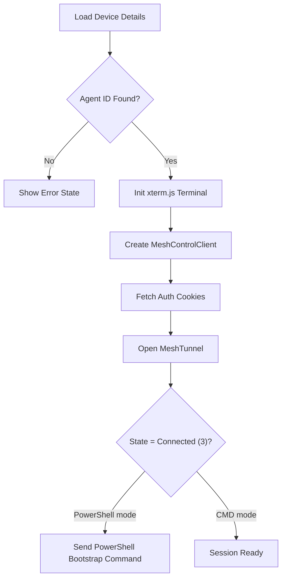

<!-- source-hash: b840e0c5659c6f3b778767d6666d23a2 -->
Renders a full-screen remote shell session for a specific device using MeshCentral tunneling and an embedded xterm.js terminal.

## Key Components

- **`RemoteShellPage`** — Next.js page component that initializes a WebSocket tunnel to a device's MeshCentral agent and mounts an interactive terminal emulator
- **`MeshTunnel`** — Manages the WebSocket connection lifecycle (connect, reconnect, state transitions) for the remote shell session
- **`MeshControlClient`** — Handles MeshCentral authentication cookie retrieval and relay tunnel signaling
- **`WINDOWS_POWERSHELL_CMD`** — Fallback command chain that attempts multiple PowerShell binary locations on Windows when `shellType=powershell`
- **`TunnelState`** — Numeric state enum (`0=Idle`, `1=Connecting`, `2=Open`, `3=Connected`) reflected in the UI status indicator

## Usage Example

```typescript
// Navigate to a remote shell session via URL:
// /devices/[deviceId]/remote-shell?shellType=powershell
// /devices/[deviceId]/remote-shell?shellType=cmd

// The page resolves deviceId from route params and shellType from query string:
const shellType = searchParams.get('shellType') === 'powershell' ? 'powershell' : 'cmd';

// Terminal is lazily loaded after MeshCentral agent ID is confirmed available:
const { deviceDetails } = useDeviceDetails(deviceId, { polling: false });
const meshcentralAgentId = deviceDetails?.toolConnections
  ?.find(tc => tc.toolType === 'MESHCENTRAL')?.agentToolId;
```

## Connection Flow



## State Handling

| Condition | Rendered Output |
|-----------|----------------|
| `isDeviceLoading` | Animated skeleton layout |
| `deviceError` | Error message + Back button |
| `!meshcentralAgentId` | MeshCentral agent missing warning |
| Ready | Full terminal UI with status badge + Disconnect button |