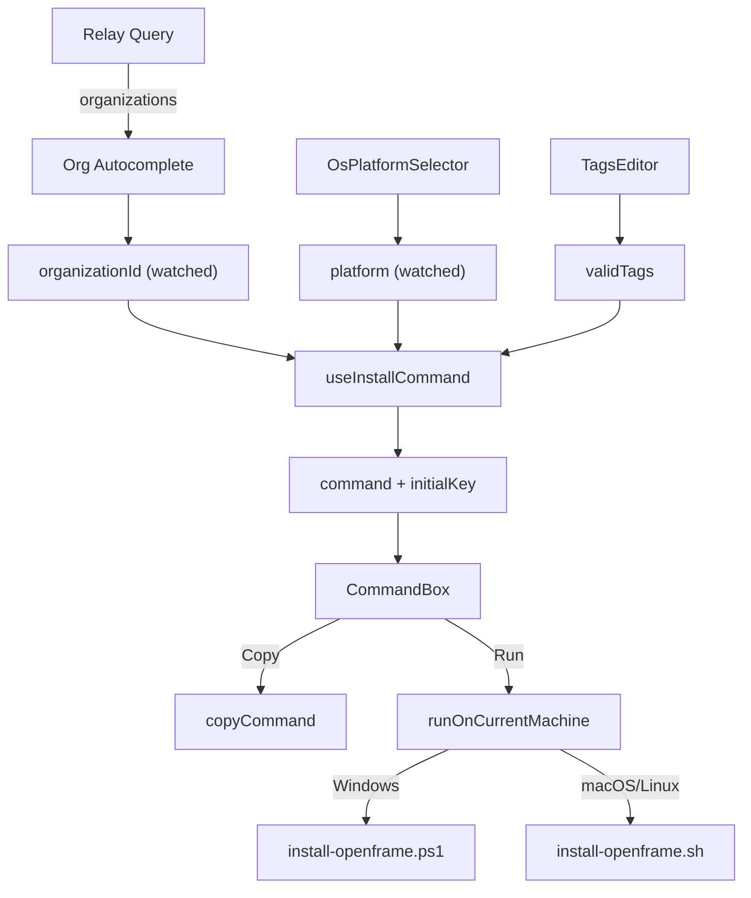

<!-- source-hash: fc948ac63005c332aeaa430cb0d4876d -->
A client-side React component that renders the "New Device" onboarding page, allowing technicians to select a customer organization and OS platform, configure device tags, and generate or download an installer command script.

## Key Components

- **`NewDeviceContent`** — Main exported component orchestrating the device registration flow
- **`newDeviceContentQuery`** — Relay GraphQL query fetching up to 100 organizations with avatar/metadata
- **`newDeviceSchema`** — Zod schema validating `organizationId` (required string) and `platform` (`OSPlatformId`)
- **`validateBeforeAction`** — Shared validation guard checking form validity, secret availability, tag format, and tag uniqueness before copy/run
- **`copyCommand`** — Copies the generated install command to clipboard with visual feedback
- **`runOnCurrentMachine`** — Detects the browser OS, validates platform match, generates a platform-specific script (`.ps1` / `.sh`), and triggers a file download

## Usage Example

```typescript
// Rendered inside a Relay boundary (QueryRenderer / Suspense)
import { NewDeviceContent } from './new-device-content';

export default function NewDevicePage() {
  return (
    <RelayEnvironmentProvider environment={relayEnv}>
      <Suspense fallback={<Spinner />}>
        <NewDeviceContent />
      </Suspense>
    </RelayEnvironmentProvider>
  );
}
```

## Data Flow

