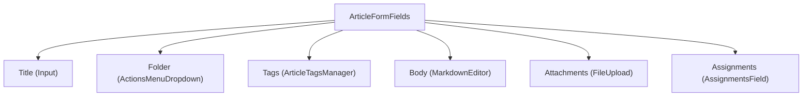

<!-- source-hash: 369957994c39cf65d3e0ccd19317a4f0 -->
Renders the form fields for creating or editing a Knowledge Base article, wiring React Hook Form controllers to UI inputs for title, folder, tags, body (Markdown), file attachments, and assignments.

## Key Components

| Export | Type | Description |
|--------|------|-------------|
| `ArticleFormFields` | Component | Controlled form fields for article creation/editing |
| `ArticleFormFieldsProps` | Interface | Props: `form` (RHF instance), `availableTags`, `tempAttachments` |

### Internal Logic

- **`buildFolderTree` / `useKnowledgeBaseFolders`** — Loads and memoizes the folder hierarchy for the folder picker dropdown
- **`handleFilesAdded`** — Normalizes `File | File[]` input and delegates each file to `tempAttachments.uploadFile`
- **`managedFiles`** — Maps internal attachment state to the shape expected by `<FileUpload>`, normalizing `'existing'` status to `'uploaded'`
- **`renderPreview`** — Stable callback rendering a `SimpleMarkdownRenderer` inside the Markdown editor preview pane

## Usage Example

```typescript
import { ArticleFormFields } from './article-form-fields';
import { useForm } from 'react-hook-form';
import { useArticleTempAttachments } from '../hooks/use-article-temp-attachments';

function ArticleEditor() {
  const form = useForm<ArticleFormData>({
    defaultValues: { title: '', folderId: null, tags: [], body: '', assignments: {} },
  });

  const tempAttachments = useArticleTempAttachments();

  return (
    <form onSubmit={form.handleSubmit(onSubmit)}>
      <ArticleFormFields
        form={form}
        availableTags={availableTags}
        tempAttachments={tempAttachments}
      />
    </form>
  );
}
```

## Field Layout

