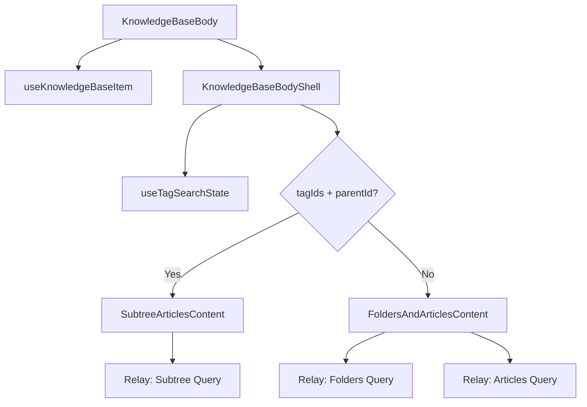

<!-- source-hash: 10defbd0291510e8cc7b957c3cbcae75 -->
React client component that renders the main body of the Knowledge Base page, handling folder/article listing, tag-based search, pagination, and folder management actions via Relay GraphQL.

## Key Components

| Export / Symbol | Description |
|---|---|
| `KnowledgeBaseBodyShell` | Shell layout component wrapping the page title, back button, action buttons, tag search, and content area |
| `FoldersAndArticlesContent` | Renders folders and articles in two separate paginated Relay queries (standard folder-level view) |
| `SubtreeArticlesContent` | Renders articles across an entire folder subtree when tag filters are active alongside a `parentId` |
| `buildActions` | Builds the `PageActionButton[]` array (Archive, New Folder, Add Article) based on whether a `parentId` is present |
| `KnowledgeBaseBodyProps` | Props interface for the top-level body component (`parentId: string \| null`) |
| Relay GraphQL fragments | Three query/fragment pairs: `Folders`, `Articles`, and `Subtree`, each with their own Relay connection keys and pagination queries |

## Usage Example

```typescript
// Render the root knowledge base page (no parent folder)
<KnowledgeBaseBody parentId={null} />

// Render a nested folder view
<KnowledgeBaseBody parentId="folder-abc-123" />
```

```typescript
// The shell is used internally to compose the page:
<KnowledgeBaseBodyShell
  parentId="folder-abc-123"
  title="Support Docs"
  backButton={{ label: 'Back', onClick: () => router.back() }}
  currentFolder={{ id: 'folder-abc-123', name: 'Support Docs', parentId: null }}
  onCurrentFolderDeleted={() => router.push('/knowledge-base')}
/>
```

## Data Flow

