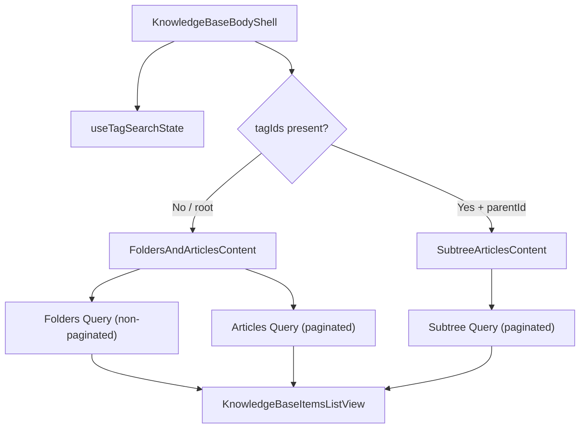

<!-- source-hash: 10defbd0291510e8cc7b957c3cbcae75 -->
React client component that renders the main body of the Knowledge Base page, handling folder/article listing, tag-based search, pagination, and new folder creation via Relay-powered GraphQL queries.

## Key Components

| Export / Symbol | Description |
|---|---|
| `KnowledgeBaseBodyShell` | Shell layout component wiring search, tags, actions, and Suspense-wrapped content |
| `FoldersAndArticlesContent` | Fetches and renders folders + articles in parallel using separate Relay pagination fragments |
| `SubtreeArticlesContent` | Fetches articles across an entire folder subtree when both `parentId` and `tagIds` are present |
| `buildActions` | Builds the page action buttons (Archive, New Folder, Add Article) based on current context |
| `knowledgeBaseBodyFoldersRelayFragment` | Relay fragment for folder-only items (non-paginated, `FOLDERS_PAGE_SIZE = 100`) |
| `knowledgeBaseBodyArticlesRelayFragment` | Refetchable Relay fragment for paginated article items |
| `knowledgeBaseBodySubtreeRelayFragment` | Refetchable Relay fragment for subtree-wide article search |

## Usage Example

```typescript
// Root-level knowledge base page
<KnowledgeBaseBody parentId={null} />

// Inside a folder
<KnowledgeBaseBody parentId="folder-abc123" />
```

## Data Flow



## Key Behaviors

- **Routing**: `parentId = null` maps to the root KB page; non-null maps to a folder view
- **Tag filtering**: When `tagIds` are active inside a folder, switches to subtree search (all nested articles, no folder rows)
- **Pagination**: Both article views use `loadNext(KNOWLEDGE_BASE_PAGE_SIZE)` with error toasts on failure
- **New Folder**: Controlled via local `useState` boolean triggering `<NewFolderModal>`
- **Archive link**: Only injected into actions at root level (`parentId === null`)