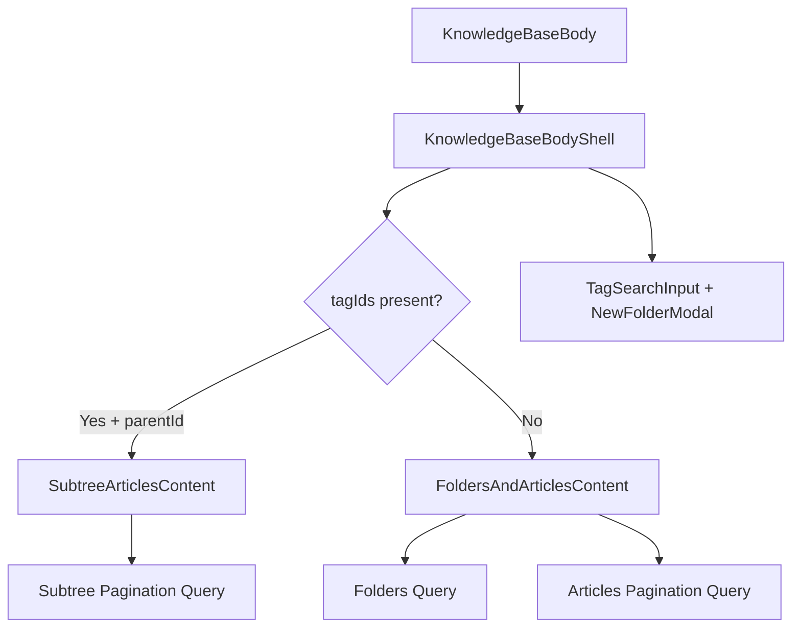

<!-- source-hash: 10defbd0291510e8cc7b957c3cbcae75 -->
Renders the main Knowledge Base page layout, handling folder/article listing, tag-based filtering, search, pagination, and folder management actions via Relay-powered GraphQL queries.

## Key Components

| Export / Function | Description |
|---|---|
| `KnowledgeBaseBodyShell` | Shell layout component wiring together search, tag filters, folder modal, and content views |
| `FoldersAndArticlesContent` | Fetches and renders separate paginated lists of folders and articles for a given parent |
| `SubtreeArticlesContent` | Fetches and renders a paginated flat list of all articles within a folder subtree when tag filters are active |
| `buildActions` | Builds the page-level action buttons (New Folder, Add Article, Archive) based on current `parentId` |
| `knowledgeBaseBodyFoldersRelayFragment` | Relay fragment for non-paginated folder list |
| `knowledgeBaseBodyArticlesRelayFragment` | Relay pagination fragment for articles with `filteredCount` |
| `knowledgeBaseBodySubtreeRelayFragment` | Relay pagination fragment for subtree-scoped tag searches |

## Usage Example

```typescript
// Render the knowledge base at the root level
<KnowledgeBaseBody parentId={null} />

// Render inside a folder
<KnowledgeBaseBody parentId="folder-uuid-123" />
```



## Notes

- **Routing split:** When both `parentId` and `tagIds` are set, the component routes through `SubtreeArticlesContent` (backend `queryArticlesInSubtree`), using a separate Relay cache key to prevent connection leakage.
- **Pagination:** Articles use `usePaginationFragment`; folders fetch up to `FOLDERS_PAGE_SIZE` (100) in a single non-paginated request.
- **Actions:** The Archive shortcut only appears at the root level (`parentId === null`).