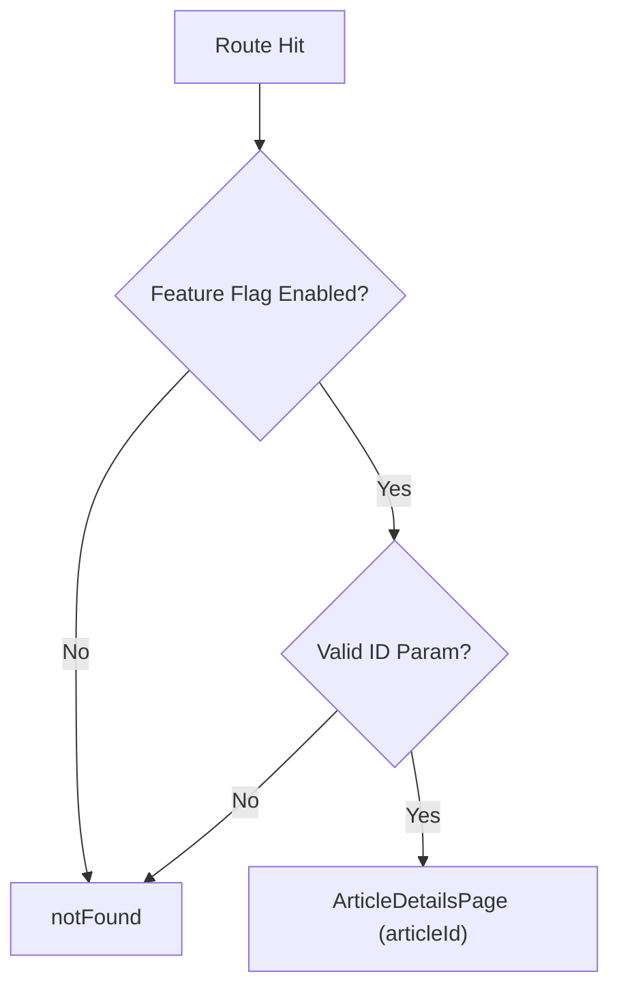

<!-- source-hash: 1a758b4884f4a511024c1366317a6220 -->
Client-side Next.js route wrapper that guards the knowledge base article details page behind a feature flag and validates the required `id` route parameter.

## Key Components

| Export | Type | Description |
|--------|------|-------------|
| `ArticleDetailsPageWrapper` | Default export (React component) | Route page component that validates feature flag and route params before rendering |
| `dynamic` | Named export (`string`) | Forces Next.js to skip static generation for this route |

## Usage Example

```typescript
// Rendered automatically by Next.js when navigating to:
// /knowledge-base/articles/[id]

// If featureFlags.knowledgeBase.enabled() returns false → 404
// If params.id is missing or not a string → 404
// Otherwise renders <ArticleDetailsPage articleId="some-id" />
```

## Behavior



> **Note:** `force-dynamic` ensures the page is always server-rendered at request time, preventing stale cached responses when article data or feature flag state changes.