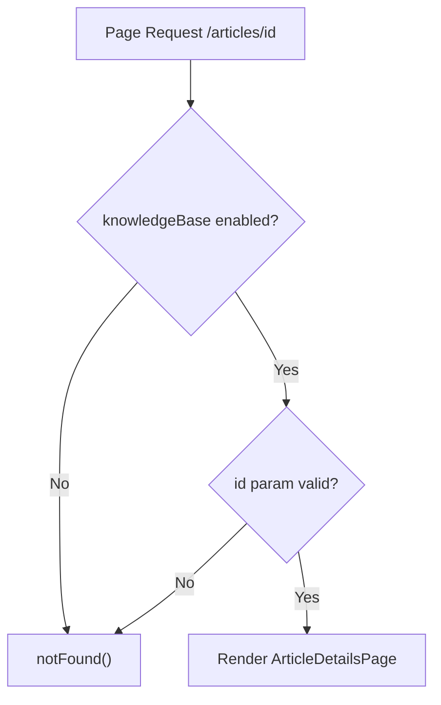

<!-- source-hash: 1a758b4884f4a511024c1366317a6220 -->
Client-side Next.js page wrapper that renders a knowledge base article by ID, with feature flag gating and parameter validation.

## Key Components

- **`ArticleDetailsPageWrapper`** — Default page component that extracts the `id` route parameter, checks the `knowledgeBase` feature flag, and renders `ArticleDetailsPage`
- **`featureFlags.knowledgeBase.enabled()`** — Guards the route; redirects to 404 if the knowledge base feature is disabled
- **`dynamic = 'force-dynamic'`** — Disables static generation, ensuring the page is always server-rendered at request time

## Usage Example

```typescript
// Route: /knowledge-base/articles/[id]/page.tsx
// Accessed via: /knowledge-base/articles/abc123

// If feature flag is disabled → notFound()
// If `id` param is missing or not a string → notFound()
// Otherwise renders:
<ArticleDetailsPage articleId="abc123" />
```

## Behavior

