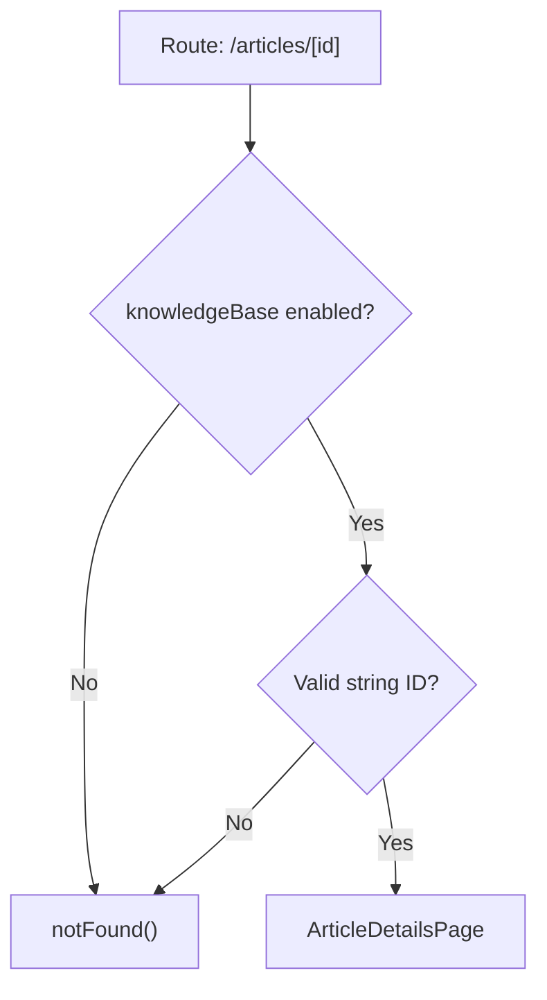

<!-- source-hash: 1a758b4884f4a511024c1366317a6220 -->
Client-side Next.js page wrapper that handles routing for individual knowledge base articles, enforcing feature flag checks and validating the article ID parameter before rendering.

## Key Components

- **`ArticleDetailsPageWrapper`** — Default export; reads the `id` route param, checks the `knowledgeBase` feature flag, and renders `ArticleDetailsPage` or triggers a 404.
- **`featureFlags.knowledgeBase.enabled()`** — Guards the route; redirects to 404 if the knowledge base feature is disabled.
- **`dynamic = 'force-dynamic'`** — Disables static generation, ensuring the page is always server-rendered at request time.

## Usage Example

```typescript
// Rendered automatically by Next.js when navigating to:
// /knowledge-base/articles/[id]

// If feature flag is disabled → notFound()
// If `id` param is missing or not a string → notFound()
// Otherwise → renders <ArticleDetailsPage articleId={id} />
```

## Behavior Flow

