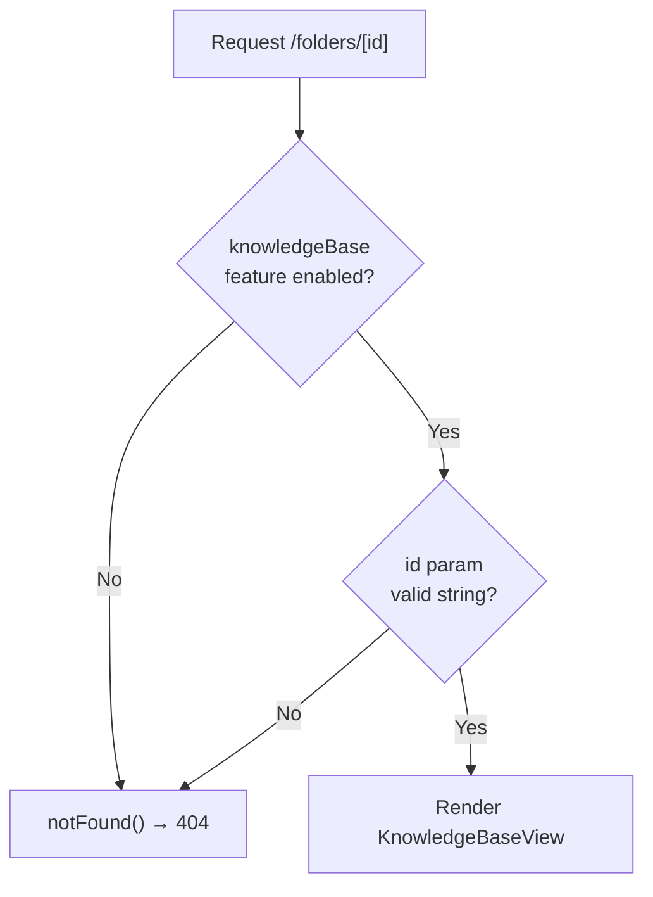

<!-- source-hash: 807be5b3dd6b63d5027fee49f10105de -->
Client-side Next.js page component that renders a Knowledge Base folder view for a specific folder ID, with feature flag gating.

## Key Components

- **`FolderPage`** — Default export page component that reads the `id` route parameter, validates the knowledge base feature flag, and renders `KnowledgeBaseView` with the resolved folder ID.
- **`featureFlags.knowledgeBase.enabled()`** — Guards access; redirects to 404 if the feature is disabled.
- **`KnowledgeBaseView`** — Receives the `folderId` prop to display folder-specific knowledge base content.
- **`dynamic = 'force-dynamic'`** — Disables static generation, ensuring the page is always server-rendered at request time.

## Usage Example

```typescript
// Accessed via route: /knowledge-base/folders/[id]
// e.g. /knowledge-base/folders/abc123

// If feature flag is disabled → 404
// If id param is missing     → 404
// Otherwise renders:
<KnowledgeBaseView folderId="abc123" />
```

## Behavior

