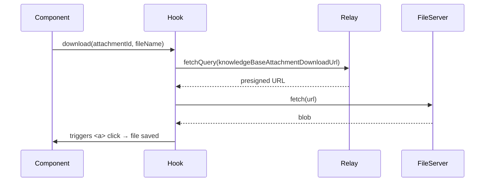

<!-- source-hash: 448410cd6dc08ed8d75ad06baf2f61b4 -->
React hook that fetches a presigned download URL for a knowledge base article attachment via GraphQL and triggers a browser file download.

## Key Components

- **`downloadArticleAttachmentQuery`** — Relay GraphQL query that resolves `knowledgeBaseAttachmentDownloadUrl` for a given `attachmentId`
- **`useDownloadArticleAttachment`** — Custom hook exposing a memoized `download` function

## Usage Example

```typescript
import { useDownloadArticleAttachment } from './use-download-article-attachment';

function AttachmentItem({ id, name }: { id: string; name: string }) {
  const { download } = useDownloadArticleAttachment();

  return (
    <button onClick={() => download(id, name)}>
      Download {name}
    </button>
  );
}
```

## Download Flow



## Behavior Notes

- Uses `fetchPolicy: 'network-only'` to always retrieve a fresh presigned URL, avoiding stale cache entries
- Constructs a temporary `<a>` element to trigger the native browser download dialog
- Cleans up the object URL via `URL.revokeObjectURL` after the download is initiated
- On any failure (missing URL, network error), surfaces a destructive toast notification with the error message