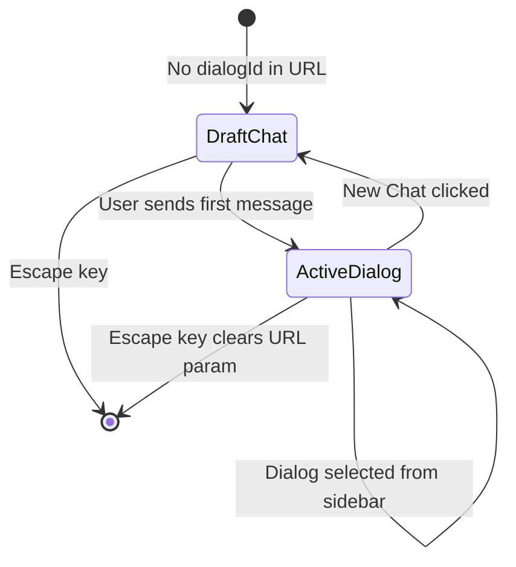

<!-- source-hash: cfbfb20e6b8e021df40db95f34e5cfb1 -->
Client-side page component for the Mingo AI chat interface, managing dialog lifecycle, real-time subscriptions, message state, and model display within the Flamingo MSP platform.

## Key Components

- **`Mingo` (default export)** — Main page component orchestrating the full chat UI: sidebar, message list, and composer
- **`useMingoChat`** — Handles message sending, dialog creation, streaming responses, and approval workflows
- **`useMingoDialogSelection`** — Manages loading/selecting existing dialogs with pagination
- **`useMingoRealtimeSubscription`** — Subscribes to live dialog events (messages, token usage, approvals)
- **`useMingoMessagesStore`** — Zustand store holding `activeDialogId`, unread counts, token usage per dialog
- **`effectiveDraft`** — Derived boolean that defaults to a "new chat" draft state when no dialog is active or resolving from the URL
- **`tokenUsage`** — Computed from the store (realtime source of truth) with fallback to query data, preventing flicker on dialog switches

## Usage Example

```typescript
// The page is rendered at the /mingo route (SaaS tenant mode only).
// Non-SaaS tenants are redirected to /dashboard automatically.

// Navigate to an existing dialog via URL:
router.push('/mingo?dialogId=dialog_abc123');

// Key state transitions:
// 1. No dialogId in URL → effectiveDraft = true → shows welcome message
// 2. User sends first message → createDialog() → URL updated → sendMessage()
// 3. Existing dialogId in URL → selectDialog() → messages loaded → realtime subscribed

// Keyboard shortcuts:
// Escape → close sidebar / exit draft / deselect dialog
```

## State Flow

