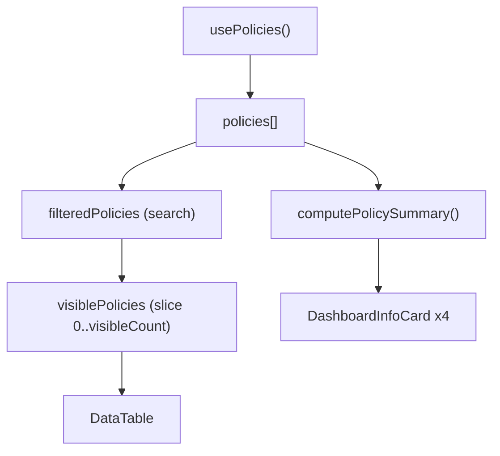

<!-- source-hash: 01bef14585e3e46172b89d1660cecc0f -->
Policies page component that renders a searchable, paginated list of monitoring policies with summary statistics, status indicators, and CRUD actions.

## Key Components

### `Policies` (default export)
Main page component that orchestrates the full policies list view, including:
- Summary dashboard cards (total, compliance rate, failures, last updated)
- Sticky search bar with debounced filtering
- Paginated data table with load-more support
- Delete confirmation modal

### `PolicyStatusCell`
Internal cell renderer that displays a policy's compliance status as a `Tag` with contextual sub-labels:
- `partial` → shows count of devices not yet responded
- `failing` → shows count of failing devices

### `parsePlatforms`
Utility that splits a comma-separated platform string into a trimmed string array for the `OSTypeBadgeGroup` renderer.

## Usage Example

```typescript
// Rendered as a Next.js page route (e.g. app/monitoring/policies/page.tsx)
import { Policies } from './policies';

export default function PoliciesPage() {
  return <Policies />;
}
```

## Data Flow



## Column Structure

| Column | Width | Hidden At |
|--------|-------|-----------|
| Name + Description | auto | — |
| Severity | `100px` | `md` |
| Platform badges | `140px` | `lg` |
| Status tag | `140px` | `md` |
| More actions menu | auto | — |
| Open in new tab | `48px` | — |