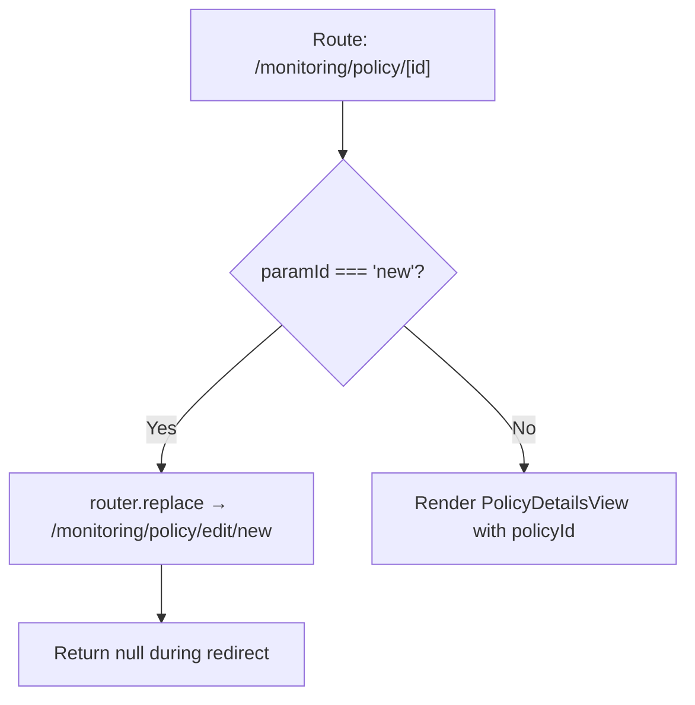

<!-- source-hash: e6195ee27279a679fd58d69964314130 -->
Client-side Next.js page component that handles routing for individual monitoring policy pages, redirecting `new` policy requests to the edit route.

## Key Components

| Export | Type | Description |
|--------|------|-------------|
| `PolicyPageWrapper` | Default Export | Page wrapper that resolves policy ID from URL params and conditionally renders or redirects |

## Usage Example

```typescript
// Accessed via: /monitoring/policy/[id]
// e.g. /monitoring/policy/abc123 → renders PolicyDetailsView
// e.g. /monitoring/policy/new   → redirects to /monitoring/policy/edit/new

<PolicyPageWrapper />
```

## Behavior



- **Redirect guard** — If the URL param `id` equals `'new'`, the component replaces the current route with `/monitoring/policy/edit/new` and renders nothing during the transition.
- **Policy rendering** — For any other `id`, it passes the value directly to `PolicyDetailsView` as `policyId`.
- **Fallback** — If `paramId` is undefined, an empty string is passed to `PolicyDetailsView`.