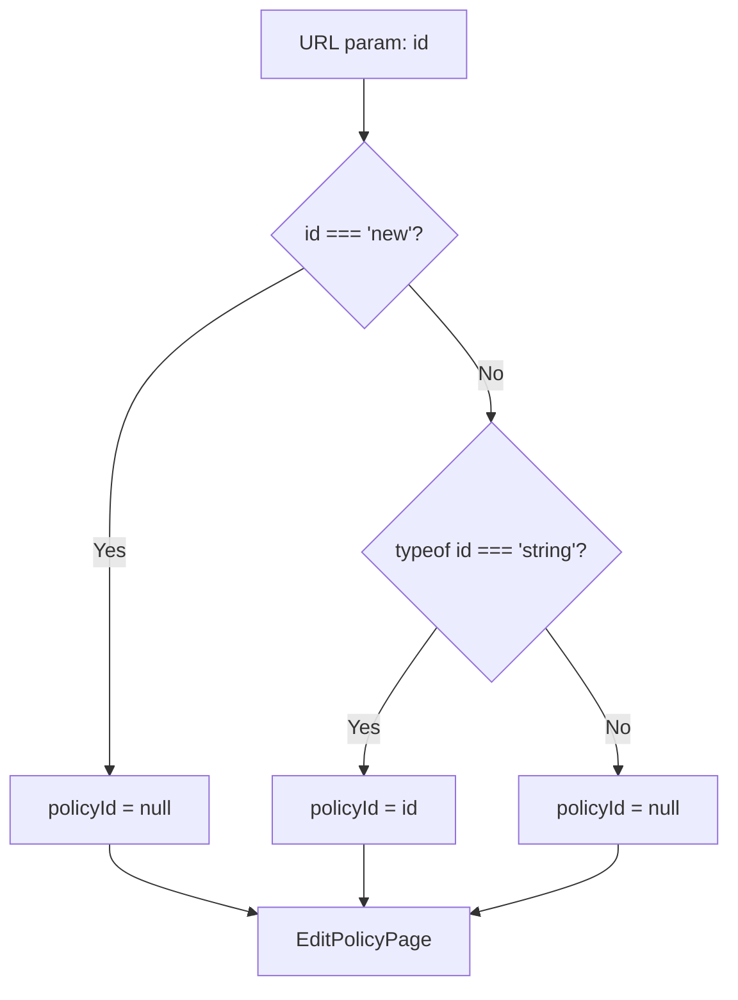

<!-- source-hash: 405cd642578a040dc7a42f831ccb4d7a -->
Client-side route wrapper for the policy edit page, extracting the `id` route parameter and delegating rendering to `EditPolicyPage`. Treats the special `"new"` segment as `null` to signal policy creation mode.

## Key Components

- **`EditPolicyPageWrapper`** — Default export. Reads the `id` param from the URL, normalizes `"new"` → `null`, and passes the resolved `policyId` to `EditPolicyPage`.

## Usage Example

```typescript
// Route: /policies/edit/[id]/page.tsx

// Accessing an existing policy
// URL: /policies/edit/abc123
// → policyId = "abc123"

// Creating a new policy
// URL: /policies/edit/new
// → policyId = null
```

## Routing Logic

