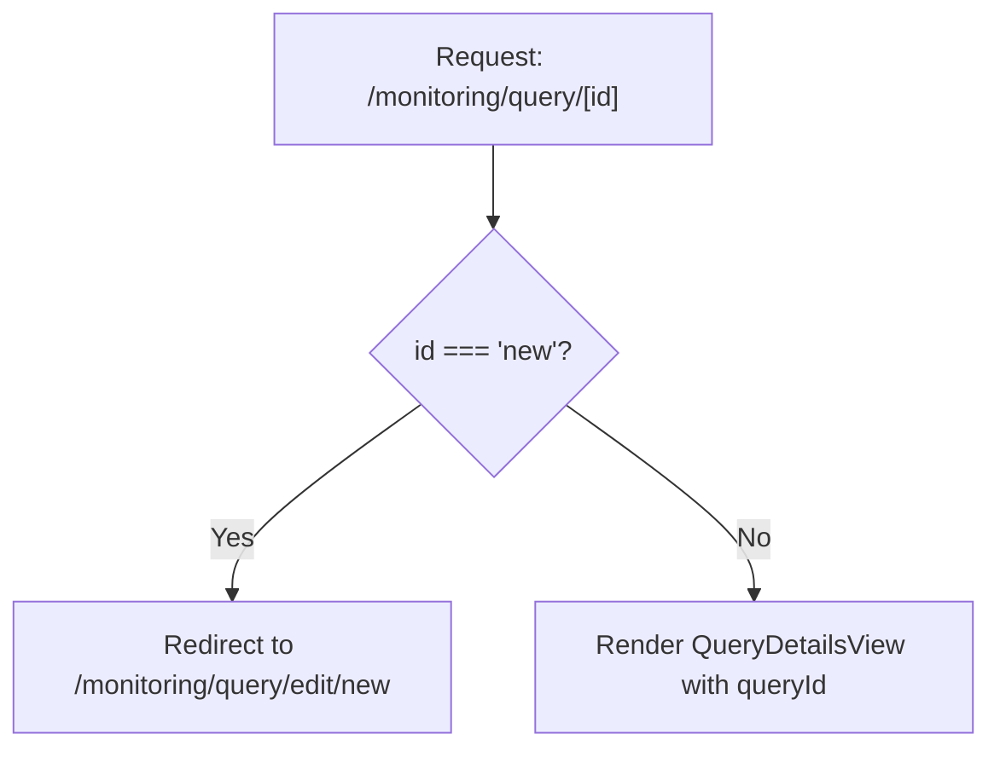

<!-- source-hash: 5060768e9e55110bc63b2bd2cb4fa0d6 -->
A Next.js client-side page wrapper that handles routing logic for query detail views, redirecting `new` query requests to the edit route while rendering the `QueryDetailsView` for existing queries.

## Key Components

| Export | Type | Description |
|--------|------|-------------|
| `QueryPageWrapper` | Default Export (React Component) | Page component that resolves query ID from URL params and conditionally renders or redirects |

## Usage Example

```typescript
// Accessed via Next.js dynamic route: /monitoring/query/[id]

// For existing queries → renders QueryDetailsView
// URL: /monitoring/query/abc-123
// → <QueryDetailsView queryId="abc-123" />

// For new queries → redirects to edit route
// URL: /monitoring/query/new
// → router.replace('/monitoring/query/edit/new')
```

## Routing Logic



## Notes

- Uses `useEffect` + `router.replace` to handle the `new` redirect without adding a history entry
- Returns `null` during the redirect transition to prevent a flash of the details view
- Falls back to an empty string if `paramId` is undefined, delegating empty-state handling to `QueryDetailsView`