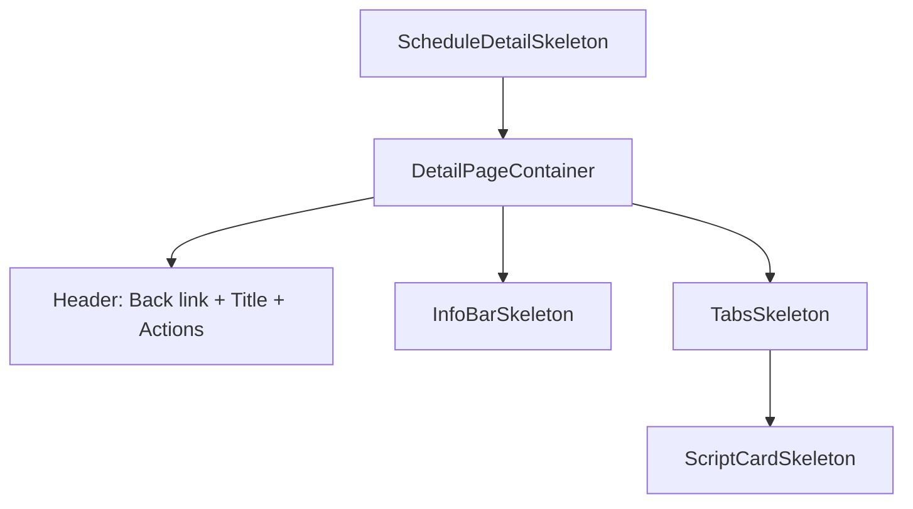

<!-- source-hash: acc0b7f61560787fd184b47ef6ec6872 -->
Skeleton loading state component for the Schedule Detail page, providing placeholder UI that mirrors the layout of `ScheduleDetailView` while data is being fetched.

## Key Components

| Component | Description |
|-----------|-------------|
| `ScheduleDetailSkeleton` | Main exported skeleton — wraps the full detail page layout inside `DetailPageContainer` |
| `InfoBarSkeleton` | 4-column info bar placeholder (Date, Time, Repeat, Platform) |
| `TabsSkeleton` | 3-tab navigation placeholder (Scripts, Devices, History) |
| `ScriptCardSkeleton` | Individual script card placeholder with name, timeout, and action button slots |

## Usage Example

```typescript
import { ScheduleDetailSkeleton } from './schedule-details-skeleton';

// Render while schedule data is loading
export default function ScheduleDetailPage() {
  const { data, isLoading } = useScheduleDetail(id);

  if (isLoading) return <ScheduleDetailSkeleton />;

  return <ScheduleDetailView data={data} />;
}
```

## Layout Structure



> All sub-components (`InfoBarSkeleton`, `TabsSkeleton`, `ScriptCardSkeleton`) are internal and not exported — use `ScheduleDetailSkeleton` as the single entry point for this loading state.