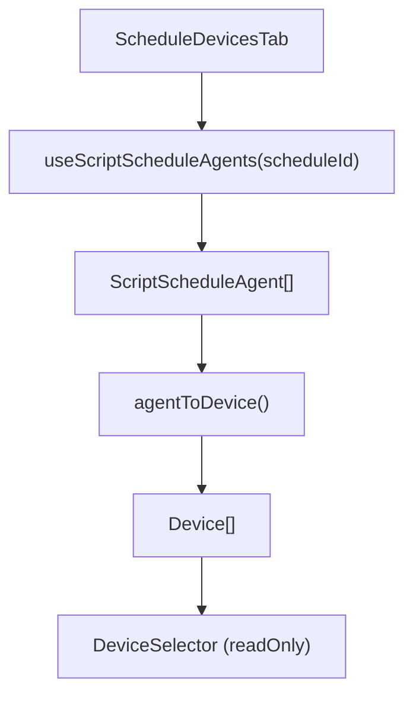

<!-- source-hash: f2b137b9c903c7d6ddcce06a7a0a9799 -->
Renders a read-only list of devices assigned to a script schedule by fetching agents via `useScriptScheduleAgents` and adapting them for the shared `DeviceSelector` component.

## Key Components

- **`ScheduleDevicesTab`** — Main export; accepts `scheduleId` and `schedule` props, displays assigned devices in a read-only table
- **`agentToDevice`** — Adapter function that maps a `ScriptScheduleAgent` (TacticalRMM shape) to the `Device` interface expected by `DeviceSelector`
- **`useScriptScheduleAgents`** — Hook that fetches agent/device assignments for the given schedule ID
- **`DeviceSelector`** — Shared component used in read-only mode with `organization`, `status`, and `actions` columns hidden

## Usage Example

```typescript
import { ScheduleDevicesTab } from './schedule-devices-tab';

// Rendered inside a tab panel for a script schedule detail view
<ScheduleDevicesTab
  scheduleId="42"
  schedule={scheduleDetail}
/>
```

## Data Flow



## Notes

- Columns `organization`, `status`, and `actions` are hidden to keep the view focused
- On fetch error, renders `LoadError` with the error message
- Agent-to-device mapping normalises `agent_id` as both `id` and `machineId`, and uses `hostname` as `displayName`