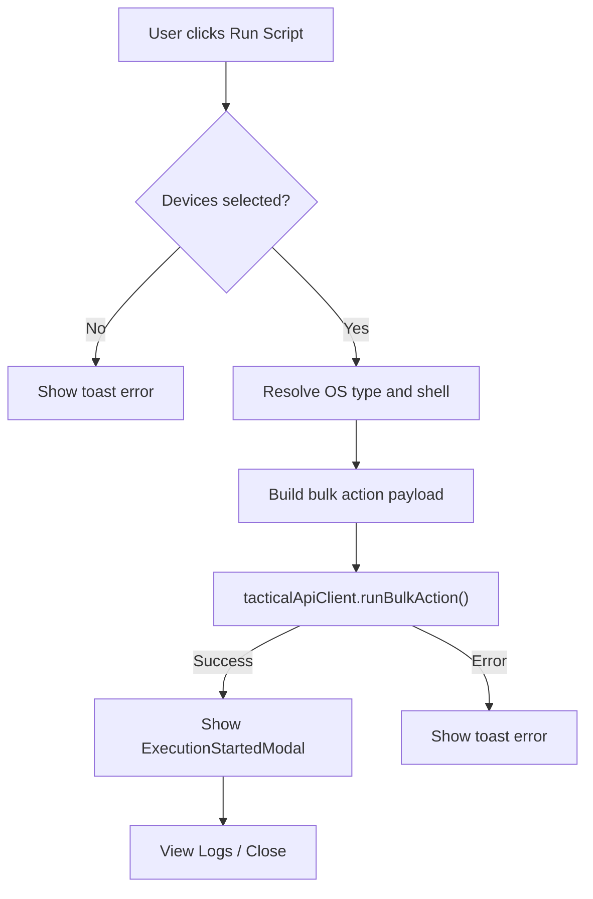

<!-- source-hash: 1f9da62b15f6c09fda080bc7b119dfd2 -->
Renders the "Run Script" page, allowing users to configure and execute a script against one or more selected devices via the Tactical RMM bulk action API.

## Key Components

- **`RunScriptView`** — Main page component accepting a `scriptId` prop; orchestrates script loading, form state, device selection, and submission
- **`runFormSchema`** — Zod schema validating `timeout` (1–86400 seconds), `scriptArgs`, and `envVars` arrays
- **`useRunScriptData`** — Custom hook that fetches script details and available devices
- **`DeviceSelector`** — Renders a filterable device list with multi-select; disables devices without a Tactical agent
- **`ScriptArguments`** — Reusable key/value argument editor used for both script args and environment variables
- **`ExecutionStartedModal`** — Confirmation modal shown after a successful bulk execution submission

## Usage Example

```typescript
// Route: /scripts/run/[scriptId]
import RunScriptView from '@/app/scripts/components/run-script-view';

export default function RunScriptPage({ params }: { params: { scriptId: string } }) {
  return <RunScriptView scriptId={params.scriptId} />;
}
```

## Submission Flow



## Form Fields

| Field | Default | Validation |
|---|---|---|
| `timeout` | `90` | 1–86400 seconds |
| `scriptArgs` | `[]` | Key/value pairs |
| `envVars` | `[]` | Key/value pairs |