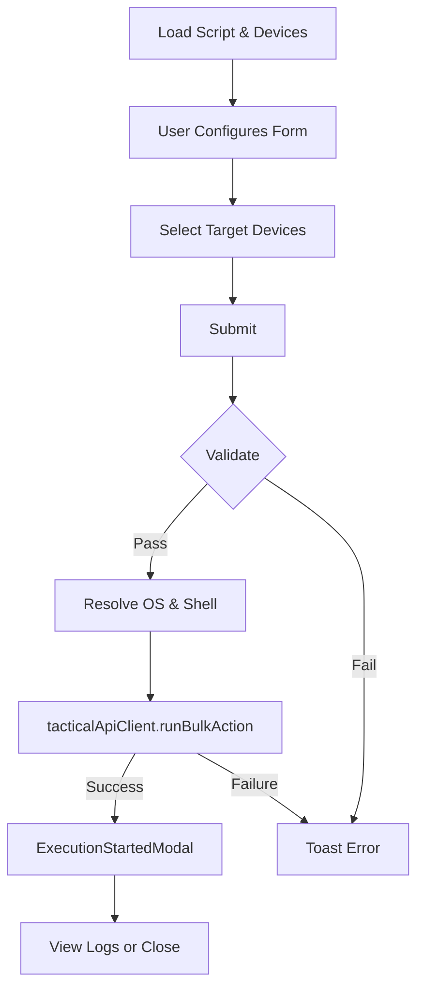

<!-- source-hash: 1f9da62b15f6c09fda080bc7b119dfd2 -->
Renders the full-page form for selecting devices and submitting a script execution request via the Tactical RMM bulk-action API.

## Key Components

| Export | Type | Description |
|--------|------|-------------|
| `RunScriptView` | React Component | Main view component accepting a `scriptId` prop |
| `RunScriptViewProps` | Interface | `{ scriptId: string }` |
| `runFormSchema` | Zod Schema | Validates `timeout`, `scriptArgs`, and `envVars` form fields |
| `RunFormData` | Type | Inferred from `runFormSchema` |

## Usage Example

```typescript
// Render the run-script view for a given script ID
import { RunScriptView } from './run-script-view';

export default function RunScriptPage({ params }: { params: { id: string } }) {
  return <RunScriptView scriptId={params.id} />;
}
```

## Form Fields

| Field | Default | Constraints |
|-------|---------|-------------|
| `timeout` | `90` | 1–86400 seconds |
| `scriptArgs` | `[]` | Key-value pairs serialized with space separator |
| `envVars` | `[]` | Key-value pairs serialized with `=` separator |

## Execution Flow



## Key Behaviors

- **Device filtering** — disables devices without a Tactical agent ID with an inline tooltip message
- **OS/shell resolution** — `resolveOsTypeFromDevices` and `resolveShellForExecution` derive runtime values from the selected device set
- **Script defaults** — `timeout`, `args`, and `env_vars` are pre-populated from `scriptDetails` on mount via `useEffect` + `reset`
- **Post-execution** — `ExecutionStartedModal` offers a shortcut to `/logs-page`