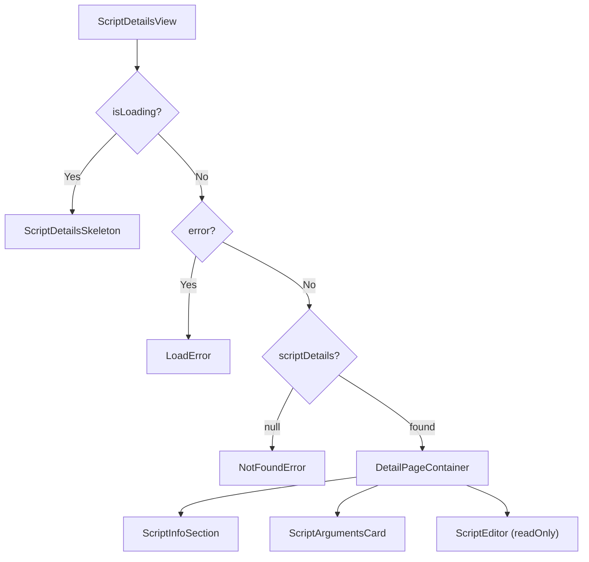

<!-- source-hash: c525d6d67dacbec72bd18bfdf8c68316 -->
Renders the full detail view for a single script, composing script metadata, arguments, environment variables, and a read-only syntax editor into a single page layout.

## Key Components

- **`ScriptDetailsView`** — Primary export; accepts a `scriptId` prop and orchestrates data fetching, loading/error states, and layout rendering
- **`useScriptDetails`** — Hook that fetches script metadata by ID, returning `scriptDetails`, `isLoading`, and `error`
- **`useSafeBack`** — Hook providing a safe back-navigation handler, defaulting to `/scripts`
- **`ScriptInfoSection`** — Displays headline description, shell type, supported platforms, and category
- **`ScriptArgumentsCard`** — Renders default arguments or environment variables in a card layout
- **`ScriptEditor`** — Read-only syntax-highlighted editor for the script body
- **`ScriptDetailsSkeleton`** — Skeleton placeholder shown during loading
- **`actions`** — Memoized array with "Edit Script" (outline) and "Run Script" (accent) action buttons; the run action only appears once the script ID is confirmed

## Usage Example

```typescript
// app/scripts/details/[scriptId]/page.tsx
import { ScriptDetailsView } from './components/script-details-view';

interface PageProps {
  params: { scriptId: string };
}

export default function ScriptDetailsPage({ params }: PageProps) {
  return <ScriptDetailsView scriptId={params.scriptId} />;
}
```

## State & Navigation Flow

