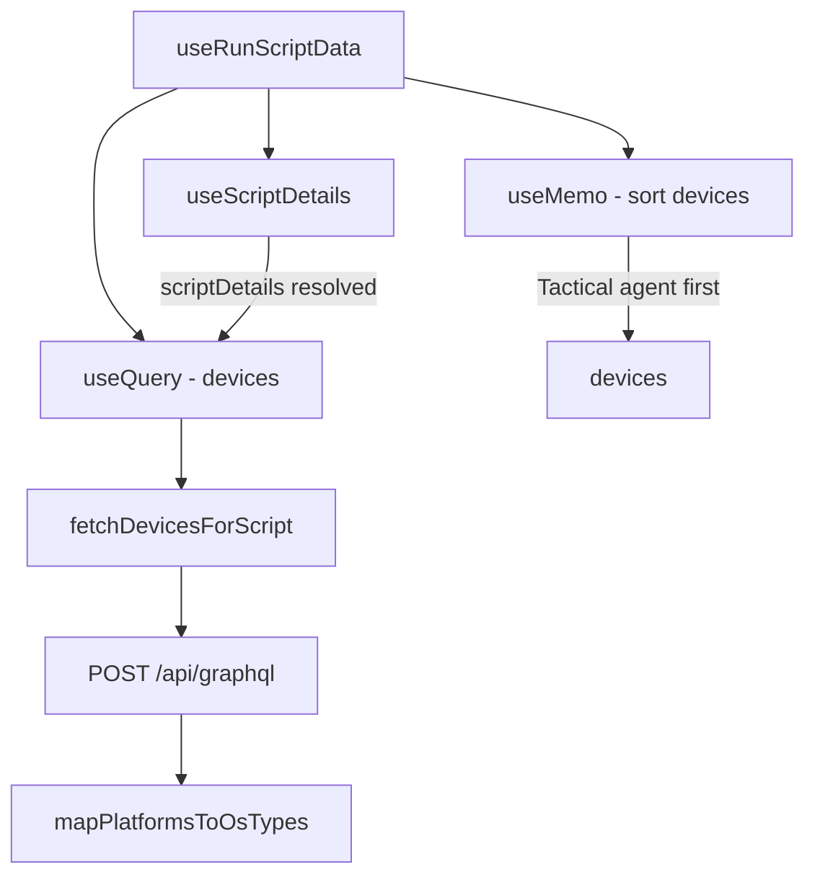

<!-- source-hash: ea56da30f45288796e1dacd176040f5d -->
Provides combined data fetching for script execution workflows, coordinating script details and eligible device list retrieval in a single composable hook.

## Key Components

**`runScriptDataQueryKeys`**
Query key factory for React Query cache management, scoped by `scriptId`.

**`fetchDevicesForScript(supportedPlatforms)`**
Async function that queries the GraphQL API for ONLINE/OFFLINE devices, optionally filtered by OS types derived from the script's supported platforms. Returns up to 100 devices sorted by status descending.

**`useRunScriptData({ scriptId })`**
Primary hook that:
- Fetches script details via `useScriptDetails`
- Lazily fetches compatible devices (only after script details resolve) via `useQuery`
- Sorts returned devices so those with a Tactical RMM agent ID appear first

## Usage Example

```typescript
function RunScriptDialog({ scriptId }: { scriptId: string }) {
  const {
    scriptDetails,
    isLoadingScript,
    scriptError,
    devices,
    isLoadingDevices,
    devicesError,
  } = useRunScriptData({ scriptId });

  if (isLoadingScript || isLoadingDevices) return <Spinner />;
  if (scriptError || devicesError) return <ErrorBanner message={scriptError ?? devicesError} />;

  return (
    <DevicePicker
      devices={devices}
      scriptName={scriptDetails?.name}
    />
  );
}
```

## Data Flow

