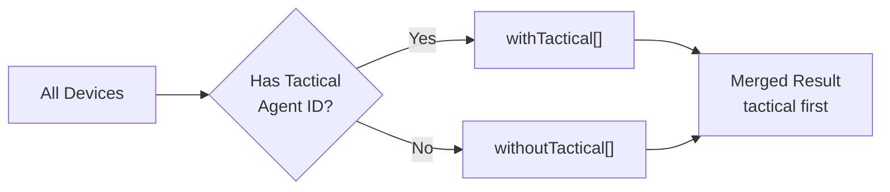

<!-- source-hash: ea56da30f45288796e1dacd176040f5d -->
Provides combined data fetching for the "run script" workflow, loading both script details and a filtered list of compatible devices in a single composable hook.

## Key Components

### `runScriptDataQueryKeys`
Query key factory for React Query cache management.

| Key | Description |
|-----|-------------|
| `devices(scriptId)` | Scoped cache key for devices filtered by script ID |

### `fetchDevicesForScript(supportedPlatforms)`
Internal async function that queries the GraphQL API for devices matching the script's supported platforms. Fetches up to 100 devices (ONLINE + OFFLINE), sorted by status descending. Throws on HTTP errors or GraphQL errors.

### `useRunScriptData({ scriptId })`
Main hook that orchestrates two dependent queries:
1. **Script details** — via `useScriptDetails`, used to derive supported platforms.
2. **Devices** — enabled only after script details resolve; fetches and sorts devices so those with a Tactical RMM agent ID appear first.

## Usage Example

```typescript
function RunScriptModal({ scriptId }: { scriptId: string }) {
  const {
    scriptDetails,
    isLoadingScript,
    scriptError,
    devices,
    isLoadingDevices,
    devicesError,
  } = useRunScriptData({ scriptId });

  if (isLoadingScript || isLoadingDevices) return <Spinner />;
  if (scriptError || devicesError) return <ErrorBanner />;

  return (
    <DevicePicker
      devices={devices}
      script={scriptDetails}
    />
  );
}
```

## Device Sort Behavior

Devices are partitioned into two groups before being returned:

