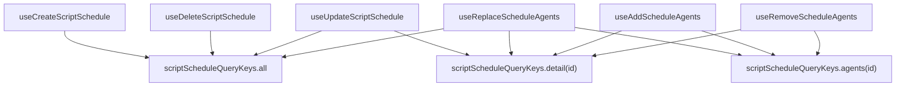

<!-- source-hash: bf5a2786cf0d80aa92ad2102090aacea -->
React Query mutation hooks for managing script schedule CRUD operations and agent assignments via the Tactical RMM API, with automatic cache invalidation on success.

## Key Components

| Export | Description |
|--------|-------------|
| `useCreateScriptSchedule` | Creates a new script schedule; invalidates all schedule queries |
| `useUpdateScriptSchedule` | Updates an existing schedule by ID; invalidates detail + all queries |
| `useDeleteScriptSchedule` | Deletes a schedule by ID; invalidates all schedule queries |
| `useReplaceScheduleAgents` | Replaces the full agent list on a schedule; invalidates agents, detail, and all queries |
| `useAddScheduleAgents` | Appends agents to a schedule; invalidates agents and detail queries |
| `useRemoveScheduleAgents` | Removes specific agents from a schedule; invalidates agents and detail queries |

## Usage Example

```typescript
import {
  useCreateScriptSchedule,
  useUpdateScriptSchedule,
  useDeleteScriptSchedule,
  useReplaceScheduleAgents,
} from './use-script-schedule-mutations';

function ScriptScheduleManager() {
  const createSchedule = useCreateScriptSchedule();
  const updateSchedule = useUpdateScriptSchedule();
  const deleteSchedule = useDeleteScriptSchedule();
  const replaceAgents = useReplaceScheduleAgents();

  // Create a new schedule
  const handleCreate = () => {
    createSchedule.mutate({
      script: 42,
      name: 'Nightly Cleanup',
      run_time_date: '2024-01-01T02:00:00Z',
      repeat: 'daily',
    });
  };

  // Update an existing schedule
  const handleUpdate = () => {
    updateSchedule.mutate({
      id: 'schedule-123',
      payload: { name: 'Updated Nightly Cleanup' },
    });
  };

  // Replace all agents assigned to a schedule
  const handleReplaceAgents = () => {
    replaceAgents.mutate({
      id: 'schedule-123',
      agents: ['agent-1', 'agent-2'],
    });
  };
}
```

## Cache Invalidation Strategy

Each mutation targets specific query keys from `scriptScheduleQueryKeys` to keep the UI consistent without over-fetching:

