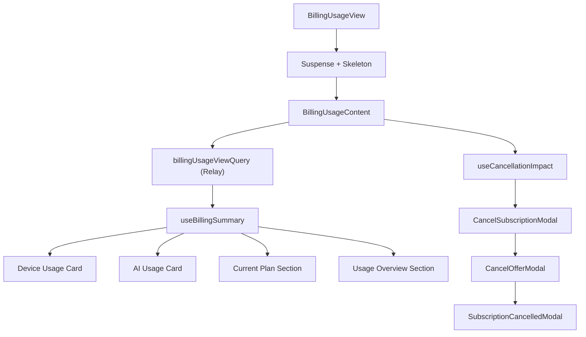

<!-- source-hash: 3915c5fdd204496d76157115895f6e84 -->
Renders the full Billing & Usage settings page, displaying subscription status, device/AI usage metrics, plan details, and a multi-step subscription cancellation flow.

## Key Components

- **`BillingUsageView`** — Public entry point; wraps content in `<Suspense>` with a skeleton fallback
- **`BillingUsageContent`** — Core view component; fetches billing data via Relay and orchestrates all UI state
- **`billingUsageViewQuery`** — GraphQL query fetching subscription, billing plan, usage metrics, and pending invoices
- **Cancel flow state machine** — Four-step flow (`idle → reason → offer → cancelled`) using `useState`, coordinating `CancelSubscriptionModal`, `CancelOfferModal`, and `SubscriptionCancelledModal`
- **`primaryAction`** — Dynamically computed CTA button (Renew / Pay Overage / Activate / Update) based on subscription flags

## Usage Example

```typescript
// Drop into any settings route — no props required
import { BillingUsageView } from './billing-usage-view';

export default function BillingPage() {
  return <BillingUsageView />;
}
```

## Data Flow



## Subscription Status Behaviors

| Status | Primary Action | Menu |
|---|---|---|
| Active | Update Subscription | Cancel option visible |
| Trial | Activate Subscription | No cancel option |
| Pending cancellation | Renew Subscription | No cancel option |
| Overdue | Pay Overage | No cancel option |