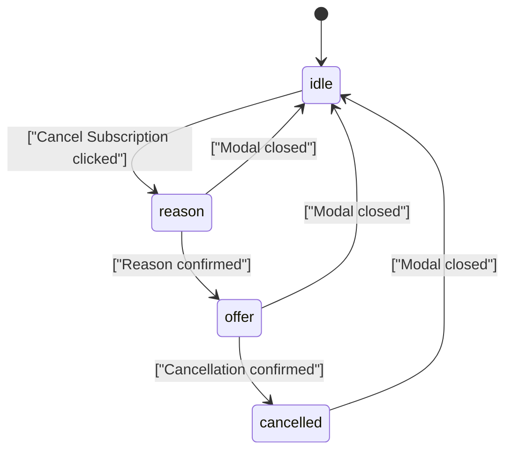

<!-- source-hash: 179f0276c41cc6444fd6e775ce23e4c4 -->
Billing & Usage dashboard view component that displays subscription status, device/AI usage metrics, plan details, and handles the subscription cancellation flow.

## Key Components

| Export | Type | Description |
|--------|------|-------------|
| `BillingUsageView` | Component | Public entry point wrapped in `Suspense` with skeleton fallback |
| `BillingUsageContent` | Component (internal) | Core content fetching and rendering logic |
| `billingUsageViewQuery` | GraphQL Query | Fetches subscription data including products, usage, invoices, and billing dates |

## Usage Example

```typescript
// Drop into any settings page route
import { BillingUsageView } from './billing-usage-view';

export default function BillingPage() {
  return <BillingUsageView />;
}
```

## Key Behaviors

- **Relay data fetching** — Uses `useLazyLoadQuery` with `store-or-network` policy for fast subsequent renders
- **Dynamic primary action** — CTA button adapts based on subscription state: renew (pending cancellation), pay overage, activate (trial), or update plan
- **Cancellation flow** — Multi-step modal sequence: `idle → reason → offer → cancelled`, collecting reason/comment before executing via `useCancelSubscription`
- **Conditional AI section** — Device usage card is always shown; AI usage card only renders when `flags.hasAi` is true
- **Pending plan block** — Shows upcoming plan changes (device/AI quantities and start date) when `flags.hasPendingPlan` is set
- **Warning banners** — Overage and limit warnings are surfaced inline with accent-colored borders and icons derived from `useBillingSummary`

## State Machine

