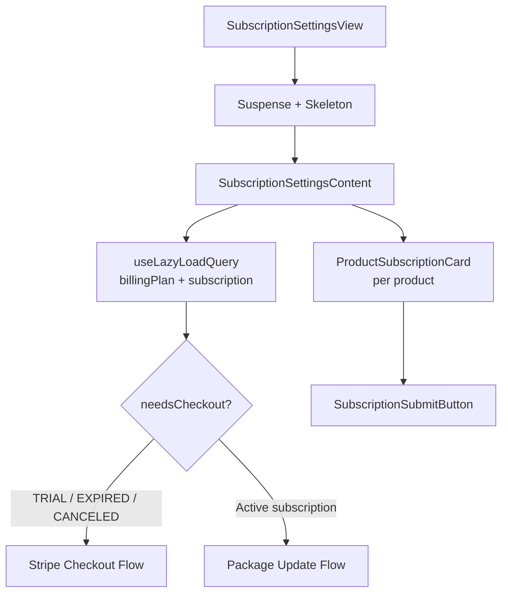

<!-- source-hash: db03b7e99f612def51a3e571ac45d201 -->
Renders the subscription settings page, allowing users to configure device management and AI assistant product subscriptions, collecting plan selections and routing to either a Stripe Checkout flow or an update flow depending on subscription status.

## Key Components

- **`SubscriptionSettingsView`** — Public entry point wrapped in `Suspense` with a skeleton fallback
- **`SubscriptionSettingsContent`** — Core view; fetches billing plan and subscription data via Relay, computes product updates, and renders the settings layout
- **`PRODUCT_DISPLAY`** — Static display config mapping `OpenframeProduct` keys (`MANAGED_DEVICES`, `AI_ASSISTANCE`) to UI labels, descriptions, and help text
- **`subscriptionSettingsViewQuery`** — Relay GraphQL query fetching `billingPlan.products` and `subscription.products` with their respective fragments
- **`aiEnabled` / `updatesMap`** — Local state tracking the AI toggle and per-product package/checkout update payloads

## Logic Flow



## Usage Example

```typescript
// Rendered as a Next.js page (app router)
// app/settings/subscription/page.tsx

export default function SubscriptionPage() {
  return <SubscriptionSettingsView />;
}
```

The component is self-contained — it resolves its own Relay data, subscription lock state via `useSubscriptionLock()`, and back-navigation via `useSafeBack('/settings/billing-usage')`. No props are required.