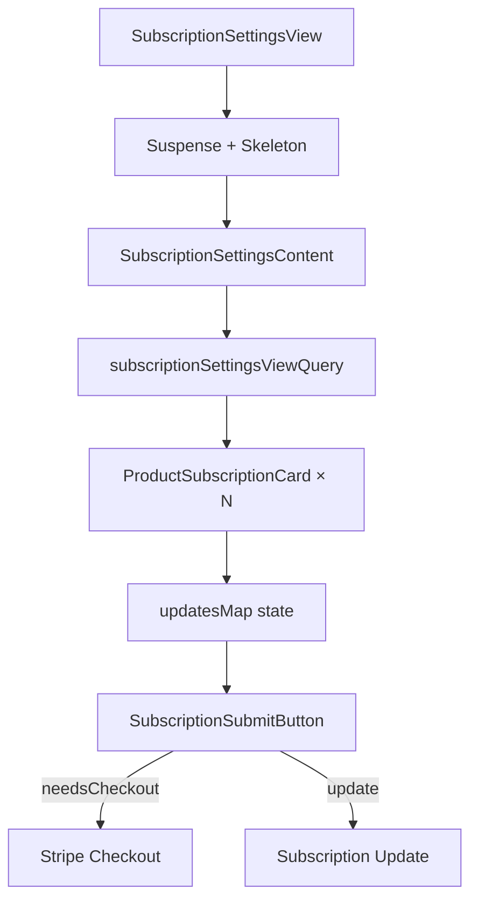

<!-- source-hash: beab3082b978965eb2d230ea6116a027 -->
Renders the subscription settings page, allowing users to configure device management and AI assistant plans by selecting packages or custom quantities, then submitting updates or initiating Stripe Checkout.

## Key Components

- **`SubscriptionSettingsView`** — Public entry point; wraps content in `Suspense` with a skeleton fallback during data loading
- **`SubscriptionSettingsContent`** — Core view that fetches billing plan and subscription data via Relay (`useLazyLoadQuery`) and orchestrates all subscription configuration logic
- **`PRODUCT_DISPLAY`** — Static display metadata map for each `OpenframeProduct` (`MANAGED_DEVICES`, `AI_ASSISTANCE`), including titles, descriptions, and labels
- **`subscriptionSettingsViewQuery`** — GraphQL query fetching `billingPlan.products` and `subscription.products` with their respective Relay fragments
- **`updatesMap`** — Local state tracking per-product `PackageUpdates` and `checkout` payloads as the user interacts with subscription cards
- **`needsCheckout`** — Derived boolean; routes to Stripe Checkout instead of a subscription update when the user is on a trial, expired trial, or canceled plan

## Usage Example

```typescript
// Mount the view in a billing settings route
import { SubscriptionSettingsView } from './subscription-settings-view';

export default function SubscriptionSettingsPage() {
  return <SubscriptionSettingsView />;
}
```

## Data Flow

