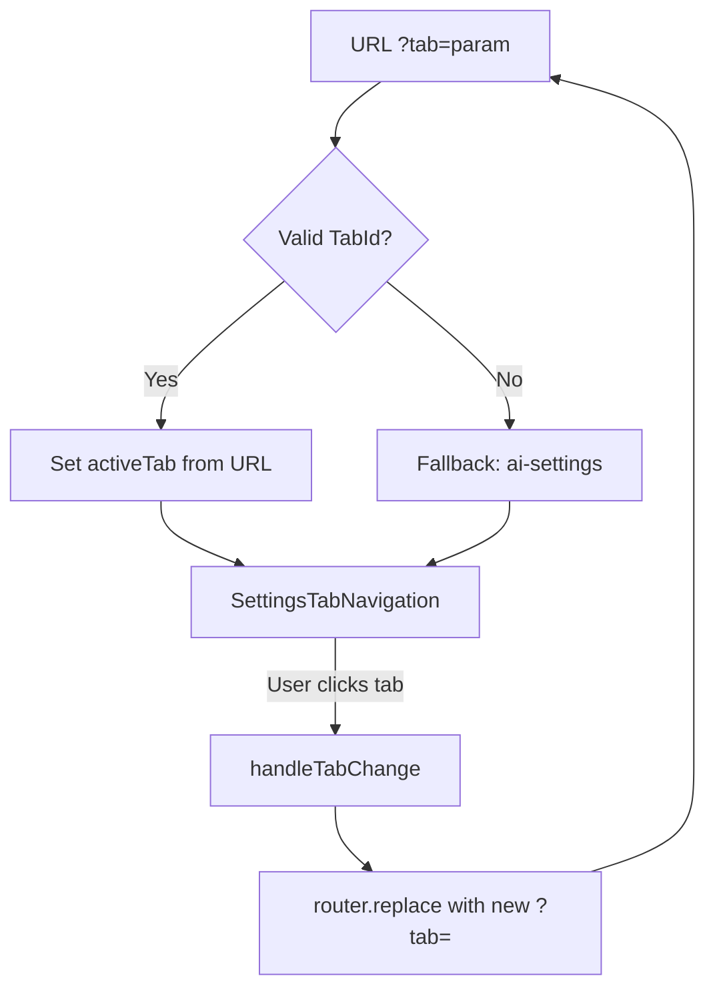

<!-- source-hash: 9e934b67e5726502dfa0325380f0979b -->
Root settings view component that manages tab-based navigation for the settings page, syncing the active tab with the URL query parameter (`?tab=...`) to support deep-linking and browser history.

## Key Components

- **`SettingsView`** — Main exported component that orchestrates tab state, URL sync, and renders the settings layout
- **`TabId`** — Union type defining valid tab identifiers: `ai-settings`, `architecture`, `company-and-users`, `api-keys`, `sso-configuration`, `profile`
- **`DEFAULT_TAB`** — Fallback tab (`ai-settings`) when no valid `tab` param is present
- **`handleTabChange`** — Updates both local state and the URL via `router.replace` without adding a history entry
- **URL sync effect** — Keeps active tab in sync with `searchParams` on back/forward navigation

## Usage Example

```typescript
// Render the settings view in a Next.js page
import { SettingsView } from './settings-view';

export default function SettingsPage() {
  return <SettingsView />;
}

// Navigate to a specific tab via URL:
// /settings?tab=api-keys
// /settings?tab=sso-configuration
```

## Tab Navigation Flow

