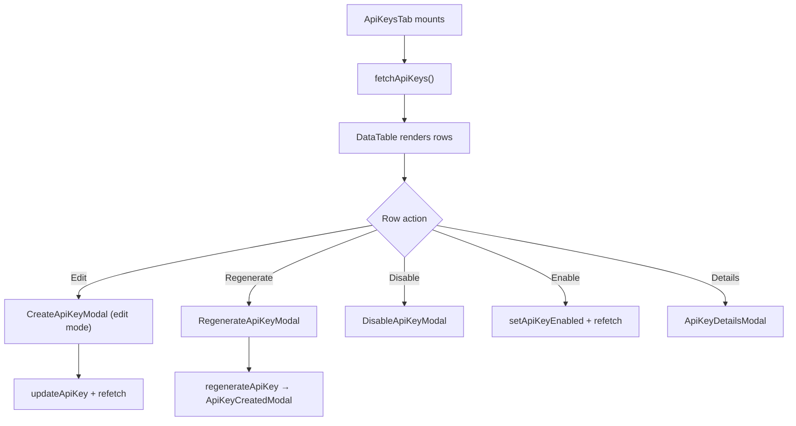

<!-- source-hash: 13fc933ba8249e9f6dadf40182953374 -->
Renders the API Keys management tab within the OpenFrame settings page, providing a full CRUD interface for creating, editing, regenerating, enabling/disabling, and viewing API key details.

## Key Components

- **`ApiKeysTab`** — Main page component that composes the data table and all modal dialogs for API key lifecycle management
- **`columns`** — Memoized `ColumnDef<ApiKeyRecord>[]` defining table columns: Name/Description, Status (Active/Inactive tag), Key ID, Usage count, Created date, Expires date, and row Actions
- **`headerActions`** — Renders two header buttons: "API Documentation" (opens Swagger UI) and "Create API Key"
- **Modal integrations** — Orchestrates five modals: `CreateApiKeyModal` (create + edit), `ApiKeyCreatedModal` (post-create full key display), `ApiKeyDetailsModal`, `RegenerateApiKeyModal`, `DisableApiKeyModal`

## Usage Example

```typescript
// Rendered as a tab inside the settings page
import { ApiKeysTab } from './api-keys';

export default function SettingsPage() {
  return (
    <Tabs>
      <TabPanel value="api-keys">
        <ApiKeysTab />
      </TabPanel>
    </Tabs>
  );
}
```

## State Flow

