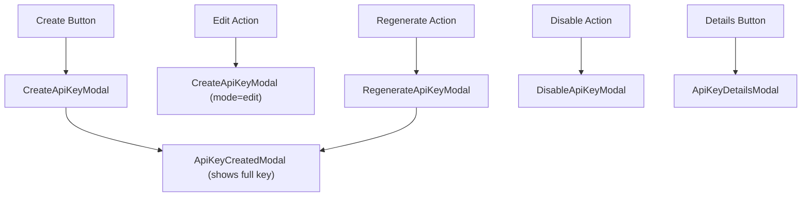

<!-- source-hash: 13fc933ba8249e9f6dadf40182953374 -->
Renders the API Keys management tab within the Settings section, providing a full CRUD interface for creating, editing, regenerating, enabling/disabling, and viewing API key details.

## Key Components

- **`ApiKeysTab`** — Main page component that orchestrates the API keys list view and all related modals
- **`columns`** — Memoized `ColumnDef<ApiKeyRecord>[]` defining table columns: Name, Status, Key ID, Usage, Created, Expires, and Actions
- **`table`** — `useDataTable` instance powering the `DataTable` with row identity keyed on `row.id`
- **Modal state** — Six modal states managed via `useState`: create, edit (reuses `CreateApiKeyModal` in `mode="edit"`), created (displays full key once), details, regenerate, and disable

## Modal Flow



## Usage Example

```typescript
// Rendered as a tab within the Settings page
import { ApiKeysTab } from './api-keys';

export default function SettingsPage() {
  return (
    <Tabs>
      <TabPanel value="api-keys">
        <ApiKeysTab />
      </TabPanel>
    </Tabs>
  );
}
```

## Notes

- **Full key visibility** — The plaintext key (`fullKey`) is only surfaced once via `ApiKeyCreatedModal`, both after creation and after regeneration
- **Enable without confirmation** — Enabling a disabled key fires `setApiKeyEnabled` immediately; disabling requires modal confirmation via `DisableApiKeyModal`
- **API docs link** — Header action opens `/swagger-ui/index.html#/` in a new tab